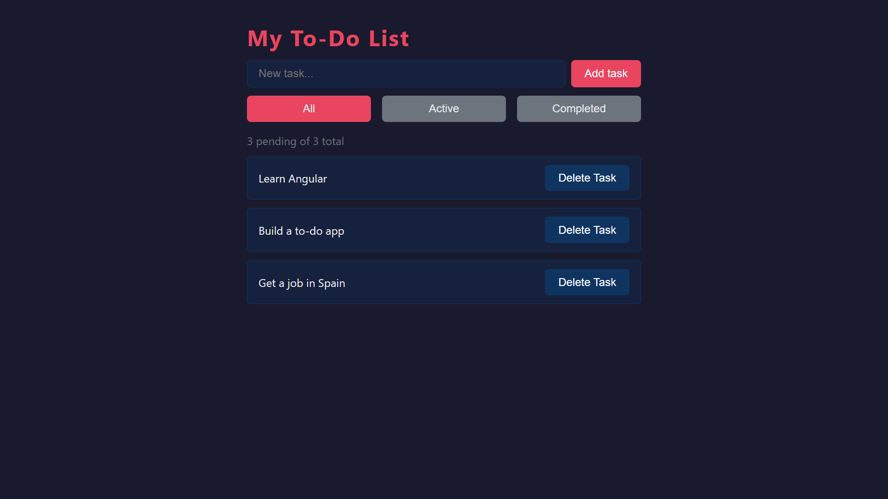

# 01 — To-do List

My first Angular project. A simple task manager built to learn the core concepts of Angular.

**Live demo:** https://01angulartodolist.netlify.app/



## Features

- Add, complete and delete tasks
- Filter tasks by status: All, Active, Completed
- Task counter — pending of total
- Empty state message when no tasks are visible

## What I learned

### Angular
- `@Component` — how to create a standalone component
- `input()` and `output()` — signal-based communication between components
- `@for` and `@empty` — render a list and handle the empty state
- `@if` — show or hide elements based on a condition
- Services with `@Injectable` and `providedIn: 'root'`
- Dependency injection with `inject()`
- `signal()`, `signal.update()`, `signal.set()` — reactive state
- `computed()` — derived values from signals
- Class binding `[class.x]` — apply CSS classes conditionally
- TypeScript `type` — union types for type safety

### CSS
- CSS variables with `:root` and `var()`
- Flexbox layout: `display: flex`, `justify-content`, `align-items`, `gap`
- Pseudo-classes: `:hover`, `:focus`
- `text-decoration`, `opacity`, `border-radius`
- Component style encapsulation in Angular

## Tech stack

- Angular 21
- TypeScript
- CSS

## How to run the project

```bash
git clone https://github.com/VMNunez/dev-learning.git
```

```bash
cd dev-learning/angular/01-todo-list
```

```bash
npm install
```

```bash
npm start
```

Open your browser at `http://localhost:4200`
