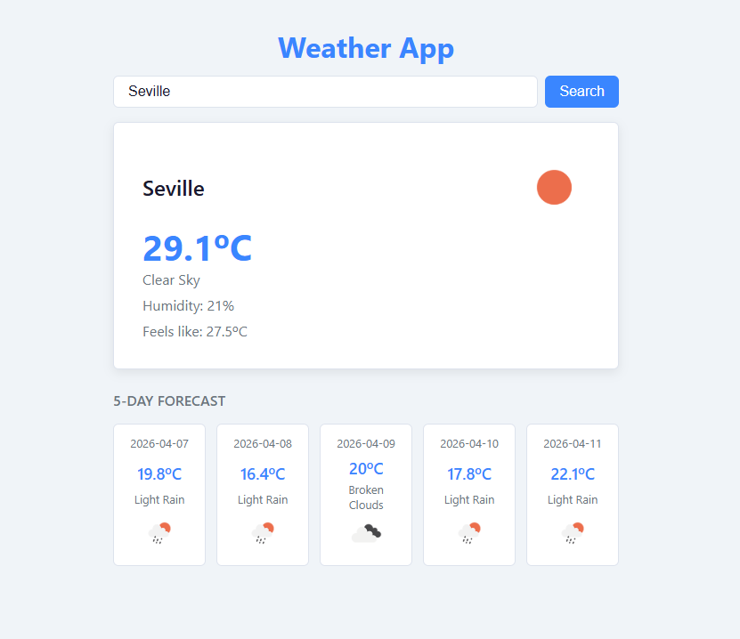

# 02 — Weather App

My second Angular project. A weather app that fetches real data from an API to learn HTTP Client and RxJS basics.

**Live demo:** https://02angularweatherapp.netlify.app/



## Features

- Search weather by city name
- Current temperature, feels like, humidity and weather condition
- Weather condition icon
- 5-day forecast
- Loading spinner while fetching data
- Error handling when the city is not found
- Madrid loaded by default on app start

## What I learned

### Angular
- `HttpClient` — call external APIs from Angular
- `subscribe` — handle Observable responses
- `forkJoin` — run multiple HTTP requests in parallel
- `ngOnInit` — run logic when the component loads
- `signal()` and `computed()` — reactive state and derived values
- `number` pipe with format `'1.0-1'`
- `SlicePipe` — cut strings in templates
- Environment files — store API keys safely
- `takeUntilDestroyed` — cancel HTTP subscriptions automatically when a component is destroyed
- `DestroyRef` — Angular token injected to notify observables when the component lifecycle ends

### CSS
- `@keyframes` and `animation` — CSS animations
- CSS spinner: `border-top-color` + `rotate` + `border-radius: 50%`
- `transition` and `transform: scale()` — hover effects

## Tech stack

- Angular 21
- TypeScript
- CSS
- OpenWeatherMap API

## How to run the project

```bash
git clone https://github.com/VMNunez/dev-learning.git
```

```bash
cd dev-learning/angular/02-weather-app
```

```bash
npm install
```

```bash
ng serve
```

Open your browser at `http://localhost:4200`