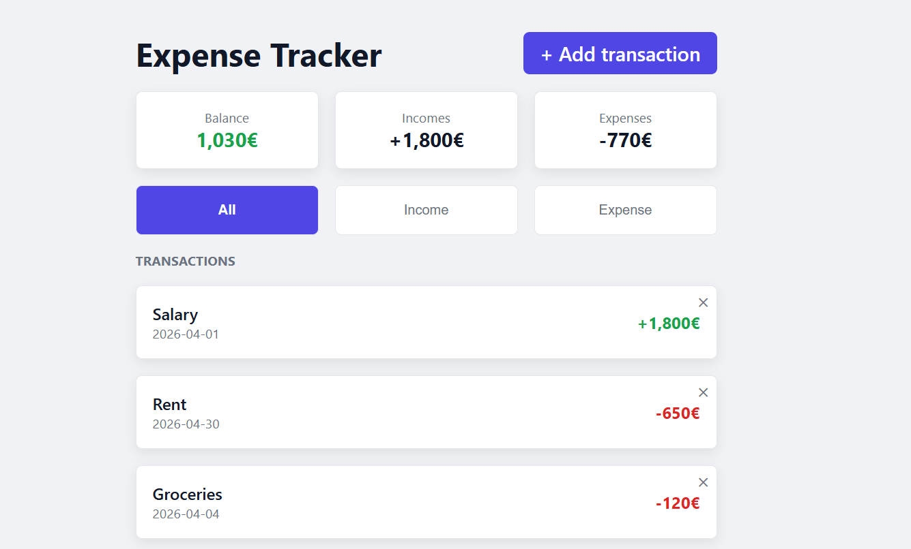

# 03 — Expense Tracker

My third Angular project. A personal finance tracker to learn reactive forms, routing, and localStorage persistence.

**Live demo:** https://03angularexpensetracker.netlify.app/



## Features

- Add income and expense transactions with a validated form
- Real-time balance, total income and total expenses
- Filter transactions by type: All, Income, Expense
- Delete transactions
- Form validation with error messages
- Data persists after page refresh (localStorage)
- Responsive design — works on mobile and desktop

## What I learned

### Angular
- `FormGroup` and `FormControl` — reactive forms
- `Validators.required` and `Validators.min()` — built-in validation
- `hasError()` and `touched` — show error messages at the right moment
- `markAllAsTouched()` — trigger all errors on submit
- `form.reset()` — reset form to initial values after submit
- `routerLink` and `RouterOutlet` — navigation between pages
- `Router` service — programmatic navigation with `router.navigate()`
- `computed()` with filters — derived state that reacts to signals
- `Omit<T, K>` — TypeScript utility type to create `NewTransaction` from `Transaction`
- Smart/dumb component pattern — page handles logic, form only emits

### CSS
- `position: absolute` and `position: relative` — element positioning
- `@media (min-width)` — responsive design, mobile first approach

## Tech stack

- Angular 21
- TypeScript
- CSS

## How to run the project

```bash
git clone https://github.com/VMNunez/dev-learning.git
```

```bash
cd dev-learning/angular/03-expense-tracker
```

```bash
npm install
```

```bash
ng serve
```

Open your browser at `http://localhost:4200`
