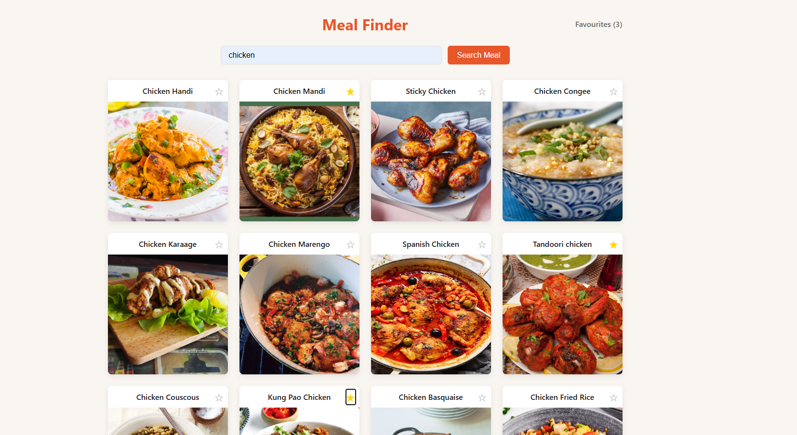

# 04 — Meal Finder

My fourth Angular project. A recipe search app to learn route parameters, ActivatedRoute, effect(), and computed() for filtering.

**Live demo:** https://04mealfinder.netlify.app/



## Features

- Search meals by name using TheMealDB API
- Browse results as cards with image and name
- Click a meal to see the full recipe on a detail page
- Save favourite meals (localStorage)
- View all favourites on a dedicated page
- Filter favourites by category

## What I learned

### Angular
- Route parameters — `path: 'detail/:id'` and `ActivatedRoute` to read the URL segment
- `effect()` — run side effects automatically when a signal changes
- `computed()` — derive filtering, counts and unique categories from signals
- `localStorage + effect()` pattern — init signal from localStorage, keep it in sync with effect()
- `takeUntilDestroyed` + `DestroyRef` — cancel HTTP subscriptions when a component is destroyed
- `event.stopPropagation()` — prevent a button click from bubbling to a parent `routerLink`
- `(keyup.enter)` — trigger a method when the user presses Enter
- `[disabled]` binding — disable a button based on a reactive condition
- `hasSearched` and `hasLoad` signal patterns — distinguish between loading, no results, and not searched yet

### CSS
- `overflow: hidden` on a card — clips image corners with `border-radius`
- `position: absolute` + `top/right` — place a badge over a card
- `transition` on the base element, not on `:hover` — correct hover animation pattern

## Tech stack

- Angular 21
- TypeScript
- CSS
- TheMealDB API (free, no API key)

## How to run the project

```bash
git clone https://github.com/VMNunez/dev-learning.git
```

```bash
cd dev-learning/angular/04-meal-finder
```

```bash
npm install
```

```bash
ng serve
```

Open your browser at `http://localhost:4200`
