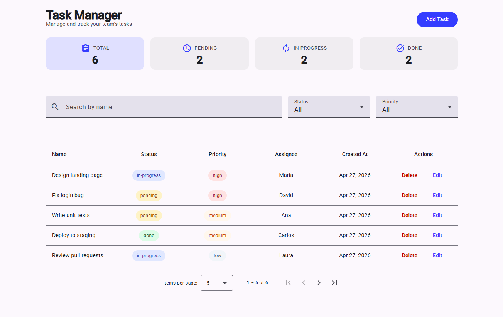

# 05 — Task Manager

My fifth Angular project. A task management app to learn Angular Material and CRUD patterns.

**Live demo:** https://05taskmanager.netlify.app/



## Features

- List tasks in a Material table with column sorting
- Add and edit tasks in a modal dialog
- Delete tasks with confirmation dialog
- Filter tasks by status, priority and name
- Task statistics cards — clickable to filter by status
- Clear all filters button — appears only when a filter is active
- Showing X of Y tasks count when filters are active
- Keyboard accessible stat cards — Tab, Enter and Space support
- Dirty check — warns before discarding unsaved changes
- Data persists with localStorage

## What I learned

### Angular
- `MatTableModule` + `MatTableDataSource` — Material table with sorting, filtering and pagination
- `MatSort` + `MatPaginator` — connect to `MatTableDataSource` via `@ViewChild` in `ngAfterViewInit`
- `MatDialog` + `MAT_DIALOG_DATA` + `MatDialogRef` — open dialogs, pass data in, receive data back
- `patchValue()` — pre-fill a reactive form with existing data for edit flows
- `ErrorStateMatcher` — control when `mat-error` appears (e.g. only on form submit)
- `NgClass` — apply multiple CSS classes dynamically based on data
- `role="button"` + `tabindex="0"` + `(keydown.enter)` — keyboard accessibility on non-button elements
- Coordinator pattern — page owns all state; child components only display and emit

### Angular Material theming
- `mat.theme()` in `material-theme.scss` — set palette, typography and density once for the whole app
- Context-specific themes — scope `mat.theme()` to a CSS class to apply a different palette per component
- `--mat-sys-*` CSS variables — Material's design token system for theme-aware colors

### CSS
- CSS grid — two-column form layout; `grid-column: 1 / -1` to span full width
- `table-layout: fixed` + `.mat-column-*` — control column widths in a Material table
- `visibility: hidden` — hide an element without removing its space from the layout

## Tech stack

- Angular 21
- TypeScript
- CSS
- Angular Material 21

## How to run the project

```bash
git clone https://github.com/VMNunez/dev-learning.git
```

```bash
cd dev-learning/angular/05-task-manager
```

```bash
npm install
```

```bash
ng serve
```

Open your browser at `http://localhost:4200`
