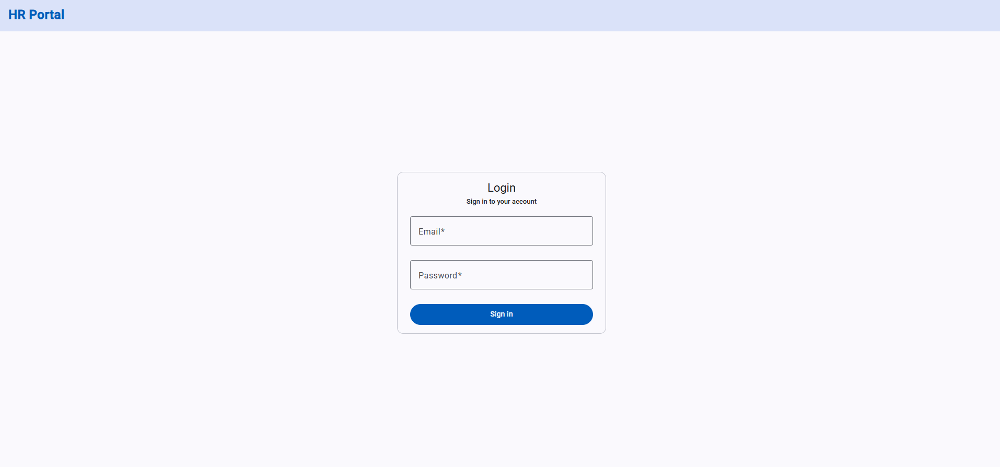
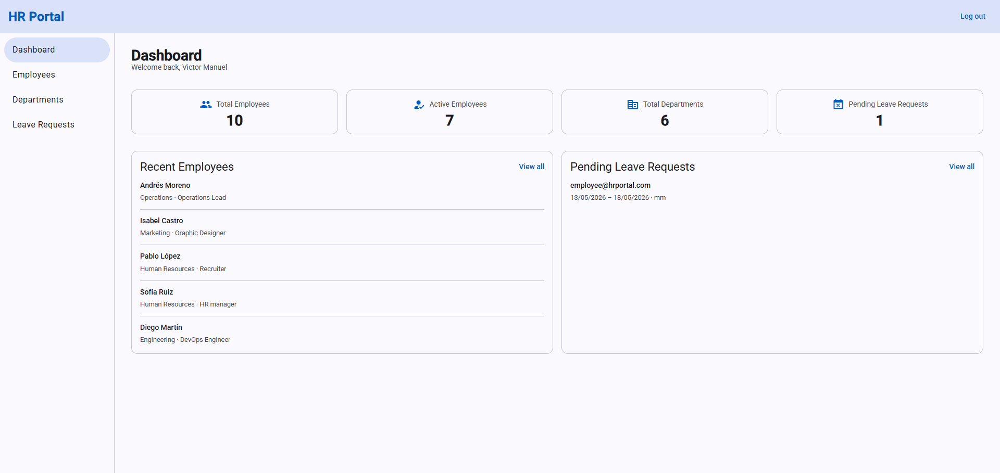
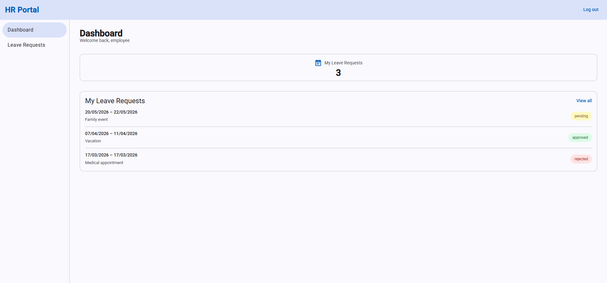
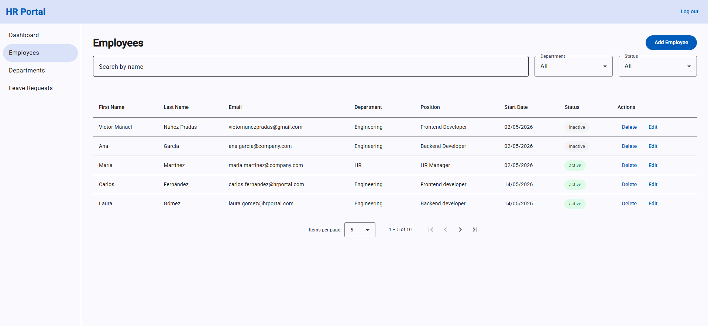
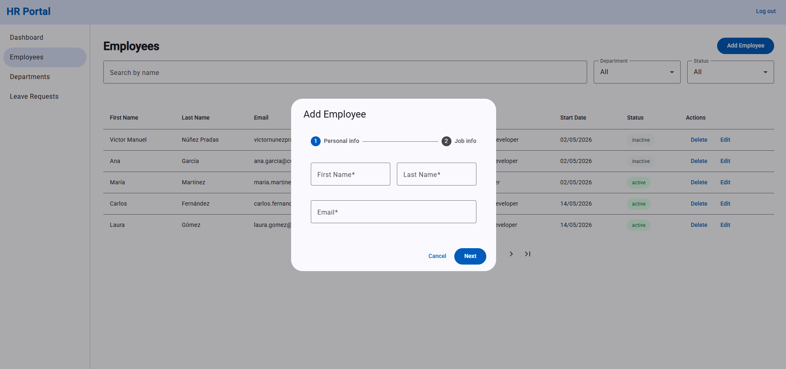
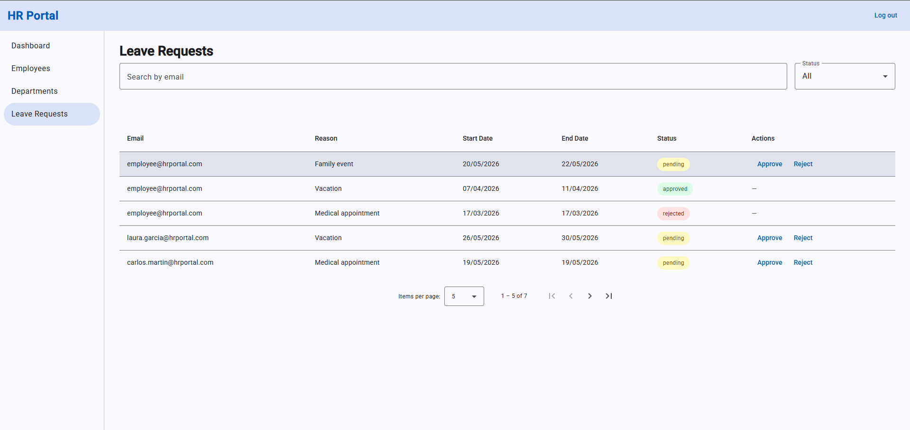

# 06 — HR Portal

My sixth Angular project. A role-based HR management app to learn route guards, lazy loading, HTTP interceptors, and enterprise architecture patterns.

**Live demo:** https://06-hr-portal.netlify.app








## Features

- Simulated authentication with admin and employee roles
- Route guards — protected routes redirect unauthenticated users
- Role-based access — admin-only pages and UI elements hidden for employees
- Employee CRUD — create (multi-step form), edit, delete (admin only)
- Department CRUD — create, edit, delete with unsaved-changes warning (admin only)
- Leave requests — employees submit requests, admins approve or reject
- Role-aware dashboard — stat cards, recent employees panel, pending requests panel
- Persistent sidebar with role-filtered navigation links
- Global HTTP interceptor — adds auth token to every outgoing request
- Data persisted in localStorage via signals and `effect()`

## Architecture decisions

- **Core/Feature/Shared folder structure** → as the app grew to six feature areas, keeping everything flat would have made it impossible to find where singletons (guards, interceptors, services) lived vs. feature-specific code → `core/` holds one-instance-for-the-whole-app code, `pages/` holds feature areas, and `shared/` holds components used in more than one feature. This is the standard structure in enterprise Angular projects.

- **Lazy loading on all feature routes** → most users are employees who never visit employee or department management pages; loading those components only on navigation reduces the initial bundle so the app starts faster for the majority of users → avoids loading admin-only code for every user on every visit.

- **Stacked guards instead of one combined guard** → `authGuard` checks if the user is logged in; `adminGuard` checks the role; keeping them separate means `authGuard` can be reused on any protected route without including role logic, and `adminGuard` can be extended without touching auth → avoids a single god-guard that mixes concerns.

- **`CanDeactivate` only on the department form** → the department form has many fields and takes time to fill; a user who accidentally navigates away loses all their work; simpler actions (status update, delete confirmation) do not need a guard because the risk of accidental data loss is low and the friction is not worth it → avoids annoying the user on every navigation.

- **`MatStepper` for employee creation** → the employee form had too many fields for a single screen; splitting into "Personal info" and "Job details" steps makes each step feel manageable → avoids overwhelming the user; the trade-off is that `matStepperNext` cannot be triggered from outside the stepper, which required manual validation in `onNext()`.

- **Coordinator pattern for pages with filters and a table** → employee page and leave request page each have a filters component, a table component, and page-level state (filter signals, computed filtered list); lifting state to the page component avoids prop drilling and keeps the table and filters reusable → the page owns all state; children only receive data and emit events.

- **localStorage with signals instead of a real backend** → the focus of this project is Angular patterns — guards, lazy loading, interceptors, role-based access; each service uses `signal()` + `effect()` to persist to localStorage automatically; the HTTP interceptor is designed to work identically with a real API — swapping localStorage for Spring Boot in a future project requires no changes to the Angular layer → clean separation between the data layer and the Angular patterns being practised.

- **Role-aware dashboard with `@if(isAdmin())`** → admin and employee have very different needs on the dashboard; the admin needs a company overview (total employees, departments, pending requests) while the employee only needs their own data; using a single `isAdmin()` computed signal as the switch keeps the logic in one place → avoids two separate dashboard components that would share most of their structure.

- **`filteredNavLinks` computed in the root `App` component** → the sidebar must show different links per role; computing the filtered list in the root component means the nav is always in sync with `currentUser()` without any child component needing to know about roles → avoids duplicating role checks in every nav link.

## What I learned

- `CanActivateFn` — functional route guard (v15+); no class, no `@Injectable`
- Role-based guard — `adminGuard` checks `currentUser().role` after `authGuard` confirms the user is logged in
- `noAuthGuard` — redirects already-logged-in users away from the login page
- Lazy loading — `loadComponent` with dynamic import; component code only loads on navigation
- Stacked guards — `canActivate: [authGuard, adminGuard]`; all must pass for the route to activate
- `HttpInterceptorFn` — functional interceptor (v15+); clones the request to add the auth header before it goes out
- `CanDeactivate` guard — warns the user before leaving a form with unsaved changes
- `MatStepper` — multi-step form with `[linear]="true"` and per-step form group validation
- `MatSnackBar` — toast notifications on every key action (add, edit, delete, approve, reject)
- `MatSidenav` app shell — persistent sidebar with role-filtered navigation links
- `MatDatepicker` — calendar picker with `provideNativeDateAdapter()` for leave request dates
- Conditional `displayColumns` with `computed()` — show or hide table columns based on user role
- Query params — `[queryParams]` on `routerLink`, read with `ActivatedRoute.snapshot.queryParamMap`
- Duplicate check pattern — `emailExists()` with optional `excludeId` to handle edit mode correctly
- Auth persistence — `signal()` initialised from `localStorage` + `effect()` to save on every change
- Role-aware UI — single `isAdmin()` computed signal drives both the sidebar links and the dashboard layout
- App shell scroll layout — `overflow: hidden` on `app-root` keeps the toolbar and sidebar fixed while only the content area scrolls
- Responsive CSS Grid — two-column dashboard panels that stack on mobile with `@media (max-width: 768px)`

## Project structure

```
src/app/
├── core/                        ← singleton logic, no UI
│   ├── guards/
│   │   ├── auth-guard.ts
│   │   ├── admin-guard.ts
│   │   ├── no-auth-guard.ts
│   │   └── deactivate-guard.ts
│   ├── interceptors/
│   │   └── auth-interceptor.ts
│   └── services/
│       ├── auth.service.ts
│       ├── employee.service.ts
│       ├── department.service.ts
│       └── leave-request.service.ts
├── pages/                       ← one folder per route (feature components)
│   ├── login-page/
│   ├── dashboard-page/
│   ├── employee-page/
│   │   └── components/
│   │       ├── employee-dialog/
│   │       ├── employee-filters/
│   │       └── employee-table/
│   ├── department-page/
│   │   ├── components/
│   │   │   └── department-list/
│   │   └── department-form/
│   └── leave-request-page/
│       └── components/
│           ├── leave-request-dialog/
│           ├── leave-request-filters/
│           └── leave-request-table/
├── shared/                      ← reusable UI components
│   └── components/
│       └── confirm-dialog/
├── models/
│   ├── user.model.ts
│   ├── employee.model.ts
│   ├── department.model.ts
│   └── leave-request.model.ts
└── app.routes.ts
```

## Tech stack

- Angular 21
- Angular Material
- TypeScript
- CSS

## How to run the project

```
git clone https://github.com/VMNunez/dev-learning.git
```

```
cd dev-learning/angular/06-hr-portal
```

```
npm install
```

```
npm start
```

Open your browser at `http://localhost:4200`

**Test accounts:**
- Admin: `admin@hrportal.com` / `admin123`
- Employee: `employee@hrportal.com` / `employee123`
