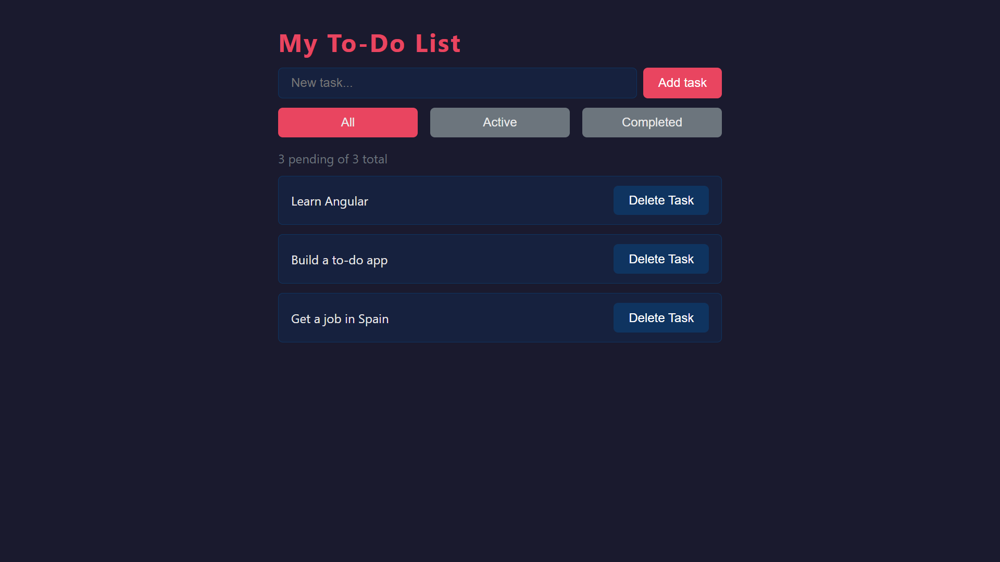

# To-do List

My 1st learning project — task manager where users add, complete and delete tasks with live filtering.

---

## Why this project

Every Angular app is built from components, services and reactive state. I built this project to understand how those building blocks work from scratch — how components communicate, how signals keep the UI in sync, and how services share state across the app.

---

## Live demo

https://01angulartodolist.netlify.app/

---

## Screenshots

**App overview**


---

## Features

- Add, complete and delete tasks
- Filter tasks by status: All, Active, Completed
- Live task counter — pending of total
- Empty state message when no tasks match the filter

---

## Architecture decisions

- Service for shared state to keep task logic out of components and accessible anywhere in the app
- `signal()` and `computed()` for reactive state to avoid manual change detection
- `input()` and `output()` for component communication — signal-based, Angular v17+ convention
- `computed()` for the filtered list and counter to recalculate automatically when tasks change
- Ids generated by a counter owned by the service, not by `Date.now()` — a clock repeats within the same millisecond, and duplicate ids make delete and toggle act on several tasks at once
- Router with a single `''` route over bootstrapping `TodoPage` directly — the app boots through `provideRouter` and `<router-outlet />` from day one, so later projects add navigation instead of retrofitting routing

---

## Tradeoffs

- No localStorage — the focus was Angular fundamentals, not data persistence
- Single service over multiple — the app is small enough that one service handles all state cleanly

---

## Future improvements

- Persist tasks with localStorage
- Due dates and priority levels
- Drag to reorder tasks

---

## What I learned

- `@Component` — how to create a standalone component
- `input()` and `output()` — signal-based communication between components
- `@for` and `@empty` — render a list and handle the empty state
- `@if` — show or hide elements based on a condition
- Services with `@Injectable` and `providedIn: 'root'`
- Dependency injection with `inject()`
- `signal()`, `signal.update()`, `signal.set()` — reactive state
- `computed()` — derived values from signals
- Class binding `[class.x]` — apply CSS classes conditionally
- Key event modifiers — `(keyup.enter)` handles Enter without inspecting the event object
- Exhaustive `switch` over a union type — omitting `default` makes a new union member a compile error
- `styleUrl` — a component declares one only when it has styles; an empty stylesheet is a build dependency that buys nothing
- `componentRef.setInput()` — a required input has no parent in a test, so the harness must supply it before the first render
- State is justified by its readers — a `signal` no template reads is not state, so the root component of a routed app declares none
- CSS variables with `:root` and `var()`
- Flexbox layout: `display: flex`, `justify-content`, `align-items`, `gap`
- Alignment properties belong to the flex container — on a non-flex element they are parsed and silently ignored

---

## Tech stack

| Layer | Technology |
|---|---|
| Framework | Angular 21 |
| Language | TypeScript |
| Styles | CSS |

---

## How to run

```
git clone https://github.com/VMNunez/dev-learning.git
```

```
cd dev-learning/angular/01-todo-list
```

```
npm install
```

```
npm start
```

Open your browser at `http://localhost:4200`
