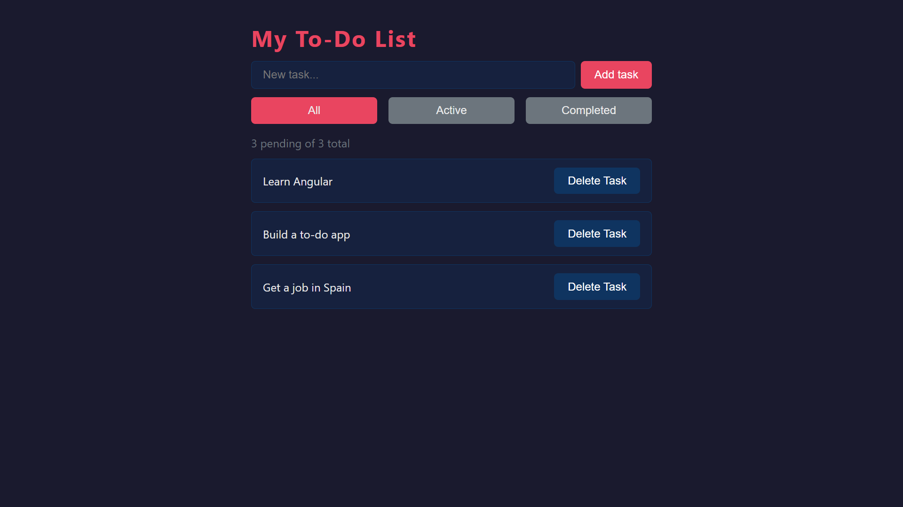

# To-do List

My 1st learning project — task manager where users add, complete and delete tasks with live filtering.

[Live demo](#live-demo) · [How to run](#how-to-run)

---

## Tech stack

| Layer | Technology |
|---|---|
| Framework |  Angular 21 |
| Language |  TypeScript |
| Routing | Angular Router |
| State | Angular signals |
| Styles |  CSS custom properties + Flexbox |

---

## Why this project

I built this first Angular project to learn the framework's core building blocks from scratch: how components communicate, how a service shares state, and how signals keep the UI in sync. To practise them, I built a task list where users can add, complete, delete and filter tasks. The visible list and pending counter derive from the same task state, so changes appear immediately and consistently under the active filter.

---

## Live demo

https://01angulartodolist.netlify.app/

No login — the app opens straight on the task list.

---

## Screenshots

**Task list — new-task form, status filters and pending counter**



---

## Features

- Add a task by typing a title and pressing Enter or clicking Add task — blank titles are ignored
- Click a task to mark it complete (struck through) or bring it back to pending
- Delete a task from the list
- Filter tasks by status: All, Active, Completed
- Live counter showing how many tasks are still pending out of the total
- A message that tells an empty list apart from a filter with no matching tasks

---

## Architecture decisions

- Feature components that inject `TaskService` themselves to keep `todo-page` a pure layout shell instead of a courier for data it never uses
- `input()` and `output()` for parent-child communication to keep the repeated leaf component dumb — data down, events up
- `computed()` for the filtered list and the counters to derive them from the task list instead of storing copies that can drift out of sync
- A local `signal<Filter>` in the list component to keep the view filter out of the service — it is UI state, not task data
- Ids generated by a private counter in the service to avoid the duplicate ids `Date.now()` produces within one millisecond
- Router with a single `''` route to boot the app through `provideRouter` from day one instead of retrofitting routing later

---

## Tradeoffs

- Signals over RxJS `BehaviorSubject` — no subscription lifecycle to manage, so the first project spends its budget on components rather than streams
- State in a service over state in the page component — it survives the component and a second page can inject it without passing it through inputs
- `completed: boolean` over a `status` union — two states with no transition rules between them, so a union would add a type without adding a guarantee
- In-memory array over `localStorage` — tasks are lost on every reload, accepted so the signal stays the only moving part; persistence is what project 04 teaches
- Plain CSS custom properties over Tailwind or Angular Material — the goal was learning the box model and flexbox by hand before a framework hides them

---

## Future improvements

- Persist tasks with localStorage
- Edit a task's title after it is created
- Due dates and priority levels
- Drag to reorder tasks

---

## What I learned

- `input()` and `output()` — signal-based communication between components
- `@for` and `@empty` — render a list and its empty state; `@empty` only sees the loop's filtered list, so telling "no tasks" from "no matches" needs the full count
- `@Injectable` with `providedIn: 'root'` — one shared instance created on first use
- `inject()` — function-based dependency injection, no constructor parameter
- `signal()`, `signal.set()`, `signal.update()` — reactive state and its two write APIs
- `computed()` — derived values that recalculate when their signals change
- `(keyup.enter)` — key event modifier; handles Enter without inspecting the event object
- `styleUrl` — a component declares one only when it has styles; an empty stylesheet is a build dependency that buys nothing
- `componentRef.setInput()` — a required input has no parent in a test, so the harness must supply it before the first render
- Service-owned state — one writer, many readers; data down through `input()`, events up through `output()`
- State justified by its readers — a signal no template reads is not state, so the root component of a routed app declares none
- `type` union — `type Filter = 'all' | 'active' | 'completed'` makes an invalid filter a compile error, not a silent no-match
- Exhaustive `switch` over a union type — omitting `default` makes a new union member a compile error

---

## Project structure

```
src/app/
├── app.ts                        ← root component, renders <router-outlet />
├── app.routes.ts                 ← one route: '' → TodoPage
├── app.config.ts                 ← application providers (provideRouter)
└── pages/
    └── todo-page/
        ├── todo-page.ts          ← page shell: composes form + list, holds no state
        ├── models/               ← the Task interface
        ├── services/             ← TaskService: owns the signal and the add/toggle/delete methods
        └── components/
            ├── task-form/        ← input box, calls addTask on the service
            ├── task-list/        ← reads the signal, derives counters and the filtered list
            └── task-item/        ← presentational row: input() task, output() toggle and delete
```

---

## How to run

```
git clone https://github.com/VMNunez/dev-learning.git
```

```
cd dev-learning/projects/01-todo-list
```

```
npm install
```

```
npm start
```

Open your browser at `http://localhost:4200`
