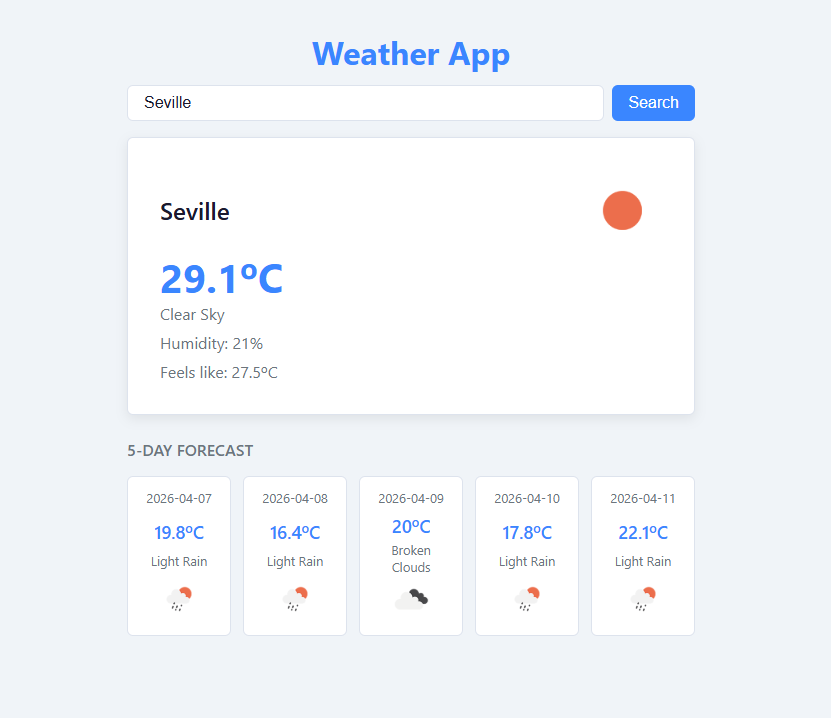

# Weather App

My 2nd learning project — weather app that fetches real data from an external API and shows current conditions and a 5-day forecast.

---

## Why this project

Real Angular apps almost always fetch data from an API. I built this project to understand how HttpClient, Observables and subscription management work — the foundation for any app that talks to a backend.

---

## Live demo

https://02angularweatherapp.netlify.app/

---

## Screenshots

**App overview**


---

## Features

- Search weather by city name
- Current temperature, feels like, humidity and weather condition
- 5-day forecast
- Loading spinner while fetching data
- Error message when the city is not found
- Madrid loaded by default on app start

---

## Architecture decisions

- `forkJoin` for parallel requests to load current weather and forecast at the same time instead of sequentially
- `takeUntilDestroyed` to cancel subscriptions automatically when the component is destroyed — no `ngOnDestroy` needed
- Environment files for the API key to keep secrets out of the repository
- Input normalised in the component that captures it to keep raw text from crossing the `output()` boundary

---

## Tradeoffs

- `subscribe` over `async` pipe — explicit subscription management was clearer for learning the Observable lifecycle
- Single component over split components — the focus was HTTP patterns, not component architecture

---

## Future improvements

- Hourly forecast breakdown
- Save favourite cities
- Geolocation to detect the user's current city automatically

---

## What I learned

- `HttpClient` — call external APIs from Angular
- `subscribe` — handle Observable responses
- `forkJoin` — run multiple HTTP requests in parallel
- `ngOnInit` — run logic when the component loads
- `signal()` and `computed()` — reactive state and derived values
- `(keyup.enter)` — key modifier so Enter and the button click reach one handler
- `number` pipe with format `'1.0-1'`
- `SlicePipe` — cut strings in templates
- Environment files — store API keys safely
- `takeUntilDestroyed` — cancel HTTP subscriptions automatically when a component is destroyed
- `DestroyRef` — Angular token injected to notify observables when the component lifecycle ends
- `@keyframes` and `animation` — CSS animations
- CSS spinner: `border-top-color` + `rotate` + `border-radius: 50%`
- `transition` and `transform: scale()` — hover effects

---

## Tech stack

| Layer | Technology |
|---|---|
| Framework | Angular 21 |
| Language | TypeScript |
| Styles | CSS |
| API | OpenWeatherMap |

---

## How to run

```
git clone https://github.com/VMNunez/dev-learning.git
```

```
cd dev-learning/angular/02-weather-app
```

```
npm install
```

```
npm start
```

Open your browser at `http://localhost:4200`
