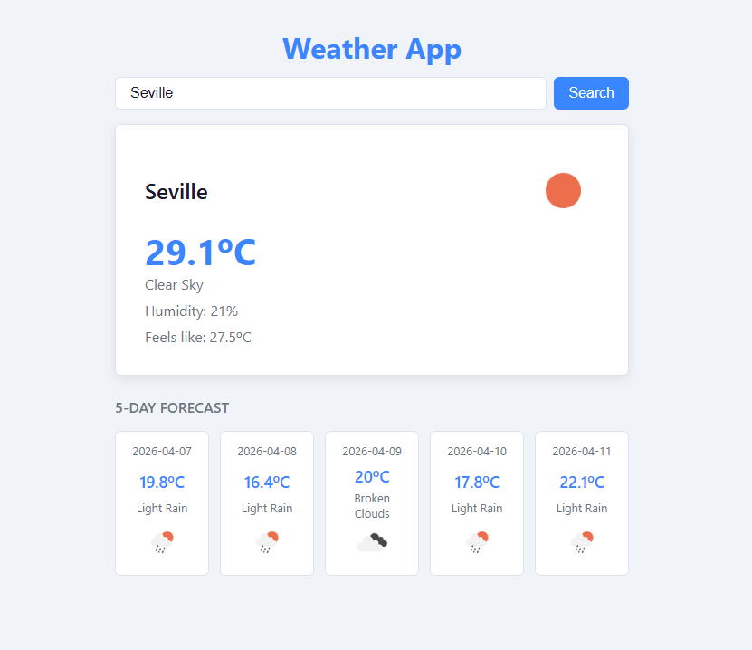

# Weather App

My 2nd learning project — weather app where you search a city and see its weather right now and for the next 5 days.

**Angular 21 · TypeScript · RxJS · OpenWeatherMap API**

[Live demo](#live-demo) · [Run locally](#how-to-run)

---

## Why this project

Checking the weather is two questions at once — what is it like now, and what is coming this week — and both depend on a remote service that can be slow or not know the city typed in. This portfolio app answers both from one search: it asks a public weather API for the current conditions and the 5-day forecast together, shows them on one page, and tells the user plainly while it is loading and when a city cannot be found.

---

## Live demo

https://02angularweatherapp.netlify.app/

---

## Screenshots

**App overview**



---

## Features

- Search weather by city name
- Current temperature, feels like, humidity and weather condition
- 5-day forecast
- Loading spinner while fetching data
- Error message when the city is not found
- Madrid loaded by default on app start

---

## Architecture decisions

- `forkJoin` to run both requests in parallel so the page shows current weather and forecast together, or one error when either request fails
- `takeUntilDestroyed` to cancel subscriptions automatically when the component is destroyed — no `ngOnDestroy` needed
- Environment files for the API key to keep the credential out of the repository and out of git history
- `HttpParams` for the query string so every value is URL-encoded and user input cannot become query syntax
- `alt=""` on the weather icons to mark them decorative — the description is already rendered as text beside each one, so an accessible name would only repeat it
- `prefers-reduced-motion` honoured to spare motion-sensitive users the decorative movement without hiding that a search is still loading
- Container and presentation components split to keep every API call and piece of state in the page, so the form, card and forecast can change without touching data loading

---

## Tradeoffs

- `subscribe` over the `async` pipe — one handler sets the results, loading and error signals together, at the cost of tearing the subscription down by hand with `takeUntilDestroyed`
- API key in the shipped bundle over a proxy backend — a frontend-only project cannot hide the key from the browser; the environment file keeps it out of the repository, and a proxy backend was out of scope
- One midday reading per day over aggregating each day's eight forecast slots — the 5-day list stays comparable day to day at the cost of the real daily minimum and maximum

---

## Future improvements

- Hourly forecast breakdown
- Save favourite cities
- Geolocation to detect the user's current city automatically

---

## What I learned

- `HttpClient` — call external APIs from Angular
- `subscribe` — handle Observable responses
- `forkJoin` — run multiple HTTP requests in parallel
- `ngOnInit` — run logic when the component loads
- `signal()` and `computed()` — reactive state and derived values
- `(keyup.enter)` — key modifier so Enter and the button click reach one handler
- `SlicePipe` — trims each forecast day's `dt_txt` timestamp down to the date shown on its card
- Environment files — keep API keys out of the repository, not out of the bundle
- `takeUntilDestroyed(destroyRef)` — cancel a subscription when the component is destroyed; the injected `DestroyRef` lets it run outside an injection context
- `prefers-reduced-motion` — drop the decorative hover and slow the loading spinner instead of stopping it

---

## Tech stack

| Layer | Technology |
|---|---|
| Framework | Angular 21 |
| Language | TypeScript |
| HTTP | Angular `HttpClient` + RxJS |
| State | Angular signals |
| Styles | CSS |
| API | OpenWeatherMap |
| Deployment | Netlify |

---

## Project structure

```
src/
├── app/
│   ├── app.ts / app.html                  ← root component, renders the router outlet only
│   ├── app.config.ts                      ← providers: router + `provideHttpClient()`
│   ├── app.routes.ts                      ← one route: '' → WeatherPage
│   └── pages/weather-page/                ← the only page: owns the search, the API call and the state
│       ├── components/
│       │   ├── weather-form/              ← search input, emits the city name
│       │   ├── weather-card/              ← current conditions for the searched city
│       │   └── weather-forecast/          ← the 5-day list, one card per day
│       ├── models/                        ← interfaces for the OpenWeatherMap responses
│       ├── services/                      ← `WeatherService`, the two HttpClient calls
│       └── utils/                         ← `getIconUrl()`, shared by both display components
└── environments/                          ← API key, never committed (see How to run)
```

---

## How to run

```
git clone https://github.com/VMNunez/dev-learning.git
```

```
cd dev-learning/projects/02-weather-app
```

```
npm install
```

The API key is not in the repository. Get a free one at [openweathermap.org](https://openweathermap.org/api), then create the `src/environments/` folder and the two files below:

```
src/environments/environment.ts               ← read by npm run build
src/environments/environment.development.ts   ← read by npm start
```

Both files hold the same thing:

```ts
export const environment = {
  apiKey: 'YOUR_API_KEY',
};
```

```
npm start
```

Open your browser at `http://localhost:4200`
