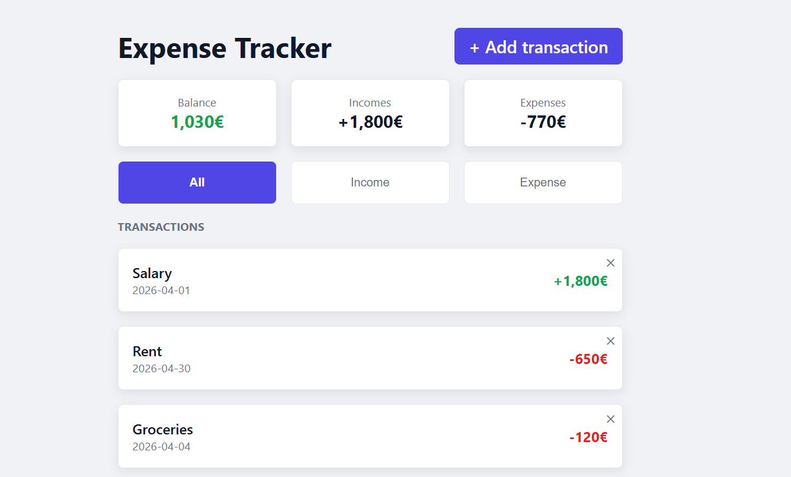

# Expense Tracker

My 3rd learning project — personal finance tracker where users log income and expenses, see live totals and filter transactions.

---

## Why this project

Forms and validation appear in almost every business app. I built this project to understand how reactive forms work, how to validate user input properly, and how to navigate between pages — patterns that appear in every real Angular project.

---

## Live demo

https://03angularexpensetracker.netlify.app/

---

## Screenshots

**App overview**


---

## Features

- Add income and expense transactions with a validated form
- Real-time balance, total income and total expenses
- Filter transactions by type: All, Income, Expense
- Delete transactions
- Form validation with inline error messages
- Data persists after page refresh
- Responsive — works on mobile and desktop

---

## Architecture decisions

- Smart/dumb component pattern — the form component only emits data, the page handles saving and updating the list
- Reactive forms over template-driven — `markAllAsTouched()` on submit requires TypeScript control over the form
- `computed()` for filtering to recalculate automatically when the signal changes, without a manual trigger
- Persistence declared once with `effect()` — the service constructor writes the signal to localStorage whenever it changes, so no mutator has to remember to save
- localStorage treated as untrusted input — the stored JSON is parsed inside a `try/catch` and shape-checked with `Array.isArray`, so a corrupt value cannot stop the service from constructing

---

## Tradeoffs

- localStorage over a real backend — the focus was reactive forms and routing, not data persistence
- `Omit<T, K>` for the create type over a separate interface — one source of truth for the transaction shape

---

## Future improvements

- Categories for transactions with colour coding
- Monthly summary chart
- Export transactions to CSV

---

## What I learned

- `FormGroup` and `FormControl` — reactive forms
- `Validators.required` and `Validators.min()` — built-in validation
- `hasError()` and `touched` — show error messages at the right moment
- `markAllAsTouched()` — trigger all errors on submit
- `form.reset()` — reset form to initial values after submit
- `routerLink` and `RouterOutlet` — navigation between pages
- `Router` service — programmatic navigation with `router.navigate()`
- `computed()` with filters — derived state that reacts to signals
- `effect()` — synchronise a signal with an external system (localStorage) instead of repeating the write in every mutator
- `Omit<T, K>` — TypeScript utility type to remove fields from an existing type
- Smart/dumb component pattern — page handles logic, form only emits
- `position: absolute` and `position: relative` — element positioning
- `@media (min-width)` — responsive design, mobile first

---

## Tech stack

| Layer | Technology |
|---|---|
| Framework | Angular 21 |
| Language | TypeScript |
| Styles | CSS |

---

## How to run

```
git clone https://github.com/VMNunez/dev-learning.git
```

```
cd dev-learning/angular/03-expense-tracker
```

```
npm install
```

```
npm start
```

Open your browser at `http://localhost:4200`
