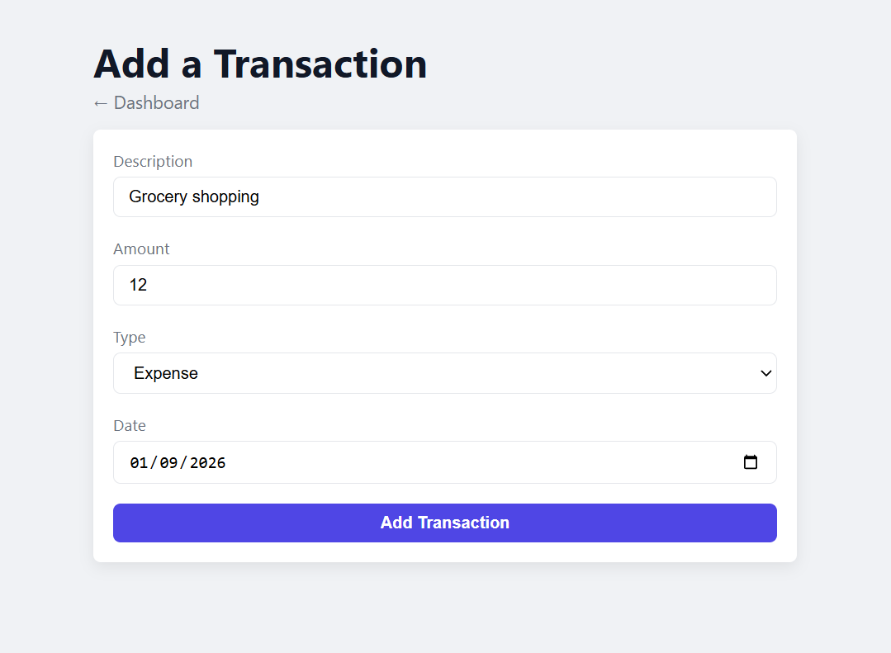

# Expense Tracker

My 3rd learning project — personal finance tracker where users log income and expenses, see live totals and filter transactions.

---

## Why this project

Forms and validation appear in almost every business app. I built this project to understand how reactive forms work, how to validate user input properly, and how to navigate between pages before applying those patterns in a real codebase.

---

## Live demo

https://03angularexpensetracker.netlify.app/

---

## Screenshots

**Dashboard — balance, income and expense totals, filter bar and transaction list**


**Add transaction — typed form with the date pre-filled from the local clock**


---

## Features

- Add income and expense transactions through a validated form with inline error messages
- Real-time balance, total income and total expenses
- Filter transactions by type: All, Income, Expense
- Delete a transaction from the list
- Data persists after page refresh
- Responsive — works on mobile and desktop

---

## Architecture decisions

- Smart/dumb component split — the two pages own the state and the service, and `summary-card`, `filter-bar`, `transaction-list` and `transaction-form` only take `input()` and emit `output()`, so every child is reusable and testable in isolation
- Component styles moved with the markup they style — each child owns its rules and uses `:host` for the layout the parent's wrapper used to provide, so no parent CSS reaches into a child
- `computed()` for the filtered list and the totals to recalculate automatically when the signal changes, without a manual trigger
- Persistence declared once with `effect()` — the service constructor writes the signal to localStorage whenever it changes, so no mutator has to remember to save
- localStorage treated as untrusted input — the stored JSON is parsed inside a `try/catch` and shape-checked with `Array.isArray`, so a corrupt value cannot stop the service from constructing
- Default form date built from the local clock (`getFullYear`/`getMonth`/`getDate`) instead of `toISOString()`, which reports the UTC day and would pre-fill yesterday after local midnight
- Transaction ids from `crypto.randomUUID()` instead of `Date.now()`, because two submits in the same millisecond would collide and `deleteTransaction` filters by id equality — deleting both rows
- Form controls typed to match the model — `nonNullable: true` and a literal union for the type select, with `getRawValue()` and a narrowing guard on submit, so the emitted value is a `NewTransaction` without an `as` assertion hiding a mismatch

---

## Tradeoffs

- Reactive forms over template-driven forms — `markAllAsTouched()` on submit and a typed form value need TypeScript control over the form, which the template-driven API does not give
- localStorage over a real backend — the focus was reactive forms and routing, and a fake API would have added setup without teaching either
- `Omit<T, K>` for the create type over a separate interface — one source of truth for the transaction shape, so adding a field cannot leave the two definitions out of sync

---

## Future improvements

- Categories for transactions with colour coding
- Monthly summary chart
- Export transactions to CSV

---

## What I learned

- `FormGroup` and `FormControl` — reactive forms
- `Validators.required` and `Validators.min()` — built-in validation
- `hasError()` and `touched` — show error messages at the right moment
- `markAllAsTouched()` — trigger all errors on submit
- `form.reset()` — reset form to initial values after submit
- `nonNullable` controls — a control that never widens its type to `null` on reset
- `getRawValue()` — typed form value that needs no `as` assertion on submit
- `routerLink` and `RouterOutlet` — navigation between pages
- `Router` service — programmatic navigation with `router.navigate()`
- `computed()` with filters — derived state that reacts to signals
- `effect()` — synchronise a signal with an external system (localStorage) instead of repeating the write in every mutator
- `Omit<T, K>` — TypeScript utility type to remove fields from an existing type
- Smart/dumb component pattern — containers own the state, children take `input()` and emit `output()`
- `:host` — style a component's own element when it replaces a styled `<div>` in the parent
- View encapsulation — a parent's CSS cannot reach markup that moved into a child component
- `crypto.randomUUID()` — collision-free ids, unlike a `Date.now()` timestamp
- Local-clock date formatting — `toISOString()` returns the UTC day, not today's local date
- `position: absolute` and `position: relative` — element positioning
- `@media (min-width)` — responsive design, mobile first

---

## Tech stack

| Layer | Technology |
|---|---|
| Framework | Angular 21 |
| Language | TypeScript |
| Forms | Angular Reactive Forms |
| Routing | Angular Router |
| State | Angular signals (`signal`, `computed`, `effect`) |
| Persistence | Browser localStorage |
| Styles | CSS (mobile-first) |

---

## Project structure

```
src/
├── app/
│   ├── models/                                 ← Transaction, NewTransaction and Filter types
│   ├── services/                               ← TransactionService: the signal, the computed totals and the localStorage sync
│   ├── pages/
│   │   ├── dashboard-page/                     ← smart page: owns the filter signal and the totals
│   │   │   └── components/
│   │   │       ├── summary-card/               ← dumb: renders one labelled amount
│   │   │       ├── filter-bar/                 ← dumb: shows the active filter, emits the new one
│   │   │       └── transaction-list/           ← dumb: renders the filtered list, emits the id to delete
│   │   └── add-transaction-page/               ← smart page: saves the transaction and navigates back
│   │       └── components/
│   │           └── transaction-form/           ← dumb: owns the reactive form, emits the new transaction
│   ├── app.routes.ts                           ← the two routes: dashboard and add
│   └── app.ts                                  ← root component with the RouterOutlet
└── styles.css                                  ← global styles and CSS variables
```

---

## How to run

```
git clone https://github.com/VMNunez/dev-learning.git
```

```
cd dev-learning/projects/03-expense-tracker
```

```
npm install
```

```
npm start
```

Open your browser at `http://localhost:4200`
