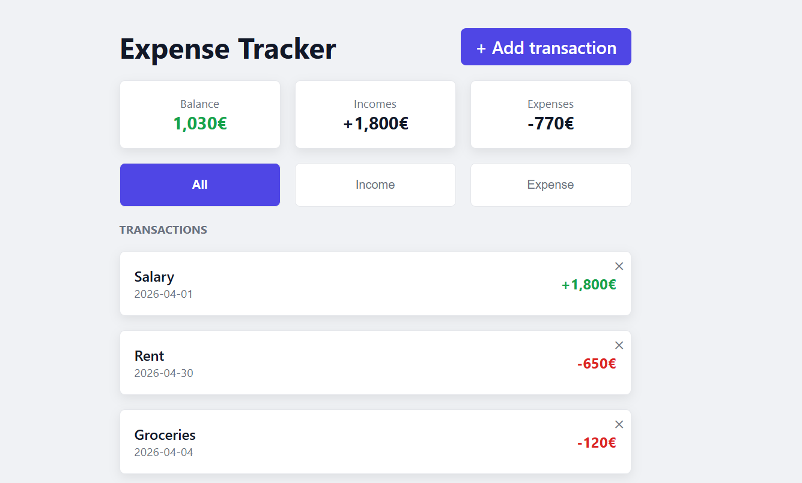
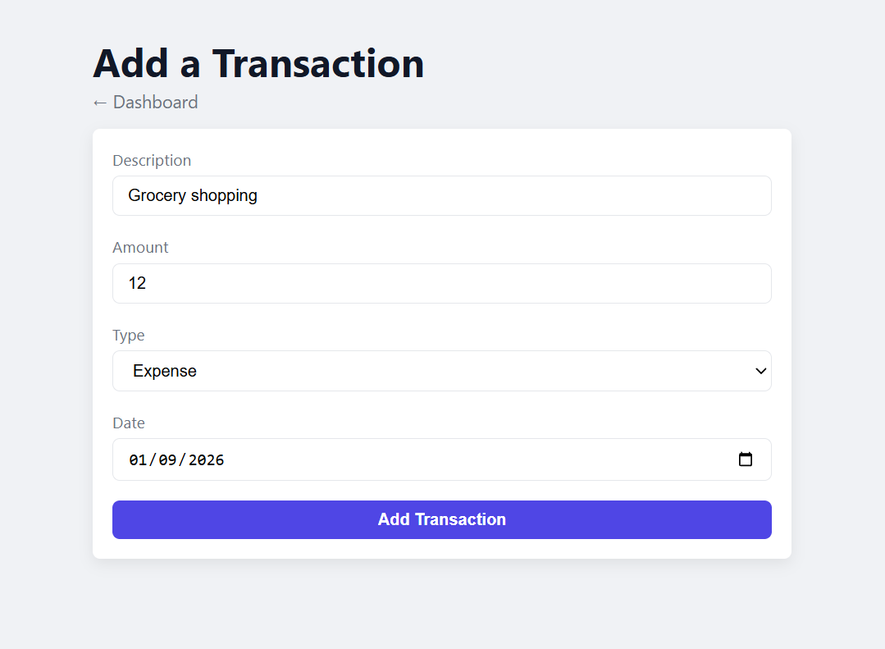

# Expense Tracker

My 3rd learning project — personal finance tracker where users log income and expenses, see live totals and filter transactions.

       

**[▶ Try the live app](https://03angularexpensetracker.netlify.app/)**

---

## Why this project

I built this project to learn reactive forms, multi-page routing and saving data in the browser with localStorage. To practise them, I built a personal finance tracker where users add income and expenses through a validated form on its own page and filter them on the dashboard. The balance and totals are always computed from the saved transactions, and the list is still there after a refresh.

---

## Live demo

https://03angularexpensetracker.netlify.app/

---

## Screenshots

**Dashboard — balance, income and expense totals, filter bar and transaction list**



**Add transaction — typed form with the date pre-filled from the local clock**



---

## Features

- Add income and expense transactions through a validated form with inline error messages
- Real-time balance, total income and total expenses
- Filter transactions by type: All, Income, Expense
- Delete a transaction from the list
- Data persists after page refresh
- Responsive — works on mobile and desktop

---

## Architecture decisions

- Smart/dumb component split to keep every child reusable and testable in isolation, with state and the service confined to the two pages
- `computed()` for the filtered list and the totals to recalculate automatically when the signal changes, without a manual trigger
- Persistence declared once with `effect()` so no mutator has to remember to write to localStorage
- localStorage treated as untrusted input so a corrupt or non-array stored value starts the app with an empty list instead of crashing it
- Default form date built from the local clock, not `toISOString()`, so the form cannot pre-fill yesterday's date just after local midnight
- Transaction ids from `crypto.randomUUID()` so two transactions can never share an id and one delete can never remove both
- Form controls typed to match the model so the submitted value needs no `as` assertion that could hide a mismatch

---

## Tradeoffs

- Reactive forms over template-driven forms — validation and a typed form value live in TypeScript, at the cost of declaring every control in the component class instead of in the template
- localStorage over a backend API — persistence with no server to build or host, so the data lives in one browser and is lost when its storage is cleared
- `Omit<Transaction, 'id'>` over a hand-written create interface — one source of truth for the transaction's shape, giving up a create type that can differ from the stored one without a further utility type

---

## Future improvements

- Edit a transaction after it has been saved
- Categories for transactions with colour coding
- Monthly summary chart
- Export transactions to CSV

---

## What I learned

- `FormGroup` and `FormControl` — reactive forms
- `Validators.required` and `Validators.min()` — built-in validation
- `hasError()` + `touched`, with `markAllAsTouched()` on submit — an error shows once a field is left, or on every field when the form is submitted
- `form.reset()` — reset form to initial values after submit
- `nonNullable` controls + `getRawValue()` — a form value typed like the model, narrowed with one guard instead of an `as` assertion
- `routerLink` and `RouterOutlet` — navigation between pages
- `Router` service — programmatic navigation with `router.navigate()`
- `computed()` with filters — derived state that reacts to signals
- `effect()` — synchronise a signal with an external system (localStorage) instead of repeating the write in every mutator
- `Omit<T, K>` — TypeScript utility type to remove fields from an existing type
- Smart/dumb component pattern — containers own the state, children take `input()` and emit `output()`
- `crypto.randomUUID()` — collision-free ids, unlike a `Date.now()` timestamp
- Local-clock date formatting — `toISOString()` returns the UTC day, not today's local date
- `JSON.parse` in `try/catch` + `Array.isArray` — stored data is untrusted input, so a bad value falls back to an empty list
- `@media (min-width)` — responsive design, mobile first

---

## Tech stack

| Layer | Technology |
|---|---|
| Framework | Angular 21 |
| Language | TypeScript |
| Forms | Angular Reactive Forms |
| Routing | Angular Router |
| State | Angular signals (`signal`, `computed`, `effect`) |
| Persistence | Browser localStorage |
| Markup | HTML5 |
| Styles | CSS (mobile-first) |
| Hosting | Netlify |

---

## Project structure

```
src/
├── app/
│   ├── models/                                 ← Transaction, NewTransaction and Filter types
│   ├── services/                               ← TransactionService: the transactions signal, add/delete and the localStorage sync
│   ├── pages/
│   │   ├── dashboard-page/                     ← smart page: owns the filter signal and the totals
│   │   │   └── components/
│   │   │       ├── summary-card/               ← dumb: renders one labelled amount
│   │   │       ├── filter-bar/                 ← dumb: shows the active filter, emits the new one
│   │   │       └── transaction-list/           ← dumb: renders the filtered list, emits the id to delete
│   │   └── add-transaction-page/               ← smart page: saves the transaction and navigates back
│   │       └── components/
│   │           └── transaction-form/           ← dumb: owns the reactive form, emits the new transaction
│   ├── app.routes.ts                           ← the two routes: dashboard and add
│   └── app.ts                                  ← root component with the RouterOutlet
└── styles.css                                  ← global styles and CSS variables
```

---

## How to run

```
git clone https://github.com/VMNunez/dev-learning.git
```

```
cd dev-learning/projects/03-expense-tracker
```

```
npm install
```

```
npm start
```

Open your browser at `http://localhost:4200`
