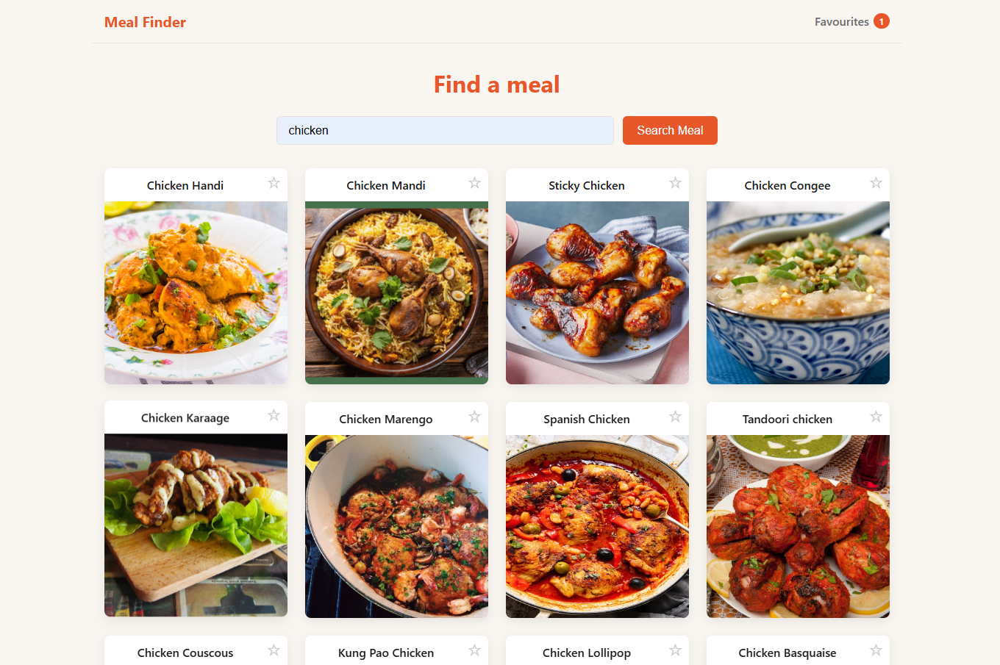

# Meal Finder

My 4th learning project — recipe search app where users find meals, view full recipes on a detail page and save favourites.

---

## Why this project

Most real Angular apps use dynamic URLs — a product ID, a user profile, a recipe. I built this project to understand how route parameters and browser history work, and how to build a more complete UX with multiple states: loading, no results, empty favourites.

---

## Live demo

https://04mealfinder.netlify.app/

---

## Screenshots

**App overview**



---

## Features

- Search meals by name using TheMealDB API
- Browse results as cards with image and name
- Click a meal to see the full recipe on a detail page
- Save and remove favourite meals
- Filter favourites by category
- Persistent favourites across page refreshes

---

## Architecture decisions

- `MealService` and `FavouriteService` split by responsibility — one owns the HTTP calls, the other the favourites state, so the favourites page never depends on `HttpClient`
- `effect()` + localStorage for favourites — automatic sync with no manual save calls anywhere in the app
- `computed()` for all filtering — memoized and recalculates only when the source signal changes
- Favourite membership is derived once in `FavouriteService` as a `computed()` `Set` of ids — a template method call re-runs on every change detection, and a `computed()` takes no arguments, so what gets derived is the lookup structure rather than the per-meal predicate
- `toSignal(paramMap)` + `effect()` on the detail page — the router reuses the component instance when only `:id` changes, so the page reacts to the parameter instead of reading it once
- `Location.back()` on the detail page — the page is reachable from two routes; a hardcoded link would always go to the wrong one
- The empty-search guard lives in `onSearchMeals()`, not only in the button's `[disabled]` — the Enter key is a second entry path to the same operation, and a UI-level rule does not cover it
- The nav lives in the root component around `<router-outlet />` — the router destroys each routed page, so chrome that must survive navigation belongs outside the outlet, and its favourites badge is a `computed()` over the `FavouriteService` signal rather than a copy per page
- `meal-card` and `category-filter` are presentational — they inject no service and receive their data through `input.required()`, so the same card serves the search page as a favourite toggle and the favourites page as a remove control
- `hasSearched`, `loadFinished` and `hasError` signals to express four distinct states — TheMealDB answers an unknown id with `200 {"meals": null}`, so a missing recipe and a failed request are different outcomes and a single results array can express neither

---

## Tradeoffs

- TheMealDB (free, no key) over a paid API — simpler setup keeps the focus on routing patterns, not configuration
- `subscribe` over `async` pipe — explicit subscription management was clearer for learning the Observable lifecycle

---

## Future improvements

- Search by ingredient
- Meal planner — assign meals to days of the week
- Shopping list generated from a selected meal plan

---

## What I learned

- Route parameters — `path: 'detail/:id'` and `ActivatedRoute.paramMap` as a stream, not a `snapshot`, so a change of `:id` reloads the page
- `effect()` — run side effects automatically when a signal changes
- `effect()` cleanup — the cleanup callback cancels the in-flight request before the effect runs again for a new route id
- `computed()` — derive filtering, counts and unique categories from signals
- `RouterOutlet` and the application shell — the router destroys and recreates the routed component on every navigation, so persistent chrome goes in the root component
- Routed view state in the URL — the search term travels as `?q=`, written with `router.navigate()` and read back with `toSignal(queryParamMap)`, so results survive navigation and `/` is linkable
- `localStorage + effect()` pattern — init signal from localStorage, keep it in sync automatically
- `asReadonly()` — keep the writable signal private in the service so its methods are the only writers
- Nullable API responses — a response type is an unchecked assertion, so `meals` is typed `Meal[] | null` and normalised where it enters the app
- Container / presentational split — a child that renders `input()` data and emits `output()` events owns no domain state, which is what lets two different parents reuse it
- `:host` — extracting a component adds a wrapper element that is `display: inline` by default, so layout the parent used to provide moves into the child's stylesheet
- Navigating elements are links — the card root is an `<a [routerLink]>`, not a `<div>` with a click handler, so keyboard focus, Enter, the `link` role and open-in-new-tab come from the tag
- Acting elements are buttons — the "Back" control is a `<button type="button">`, because an `<a>` with no `href` is skipped by the tab order, computes no `link` role and never fires on Enter
- Resetting a native control — a `<button>` styled as plain text needs its user-agent `background`, `border`, `padding` and `cursor` undone and `font: inherit` set, since form controls do not inherit the page font
- Interactive content does not nest — the favourite `<button>` sits outside the card's link and is positioned over it, because a control inside an `<a>` is invalid and its activation ambiguous
- `:focus-visible` — a focus ring shown for keyboard entry and not for a mouse click, raised to the whole card with the `:has()` relational selector
- `(keyup.enter)` — trigger a method when the user presses Enter
- `[disabled]` binding — disable a button based on a reactive condition
- Explicit remote states — the failure flag is set by the callback that observes the failure, never inferred from absent data, and `loadFinished` names what it asserts: the attempt is over, error included
- `Location.back()` — navigate to the previous page in the browser history
- Accessible name of a form control — a `<label for>` bound to the input's `id` names the field; a `placeholder` is an example value and never a name
- `.visually-hidden` — a clipped one-pixel box keeps text in the accessibility tree, which `display: none` and `visibility: hidden` remove
- Accessible name of an icon-only control — a glyph like `★` computes to no usable name, so the favourite toggles carry an explicit `aria-label` that also states the current state
- `[attr.x]` binding — ARIA attributes have no DOM property behind them, so they need attribute binding; the label itself is a `computed()` in the class, not an expression in the template
- `overflow: hidden` on a card — clips image corners with `border-radius`
- `position: absolute` + `top/right` — place a badge over a card
- `transition` on the base element, not on `:hover` — correct hover animation pattern

---

## Tech stack

| Layer | Technology |
|---|---|
| Framework | Angular 21 |
| Language | TypeScript |
| Styles | CSS |
| API | TheMealDB (free, no API key) |

---

## How to run

```
git clone https://github.com/VMNunez/dev-learning.git
```

```
cd dev-learning/angular/04-meal-finder
```

```
npm install
```

```
npm start
```

Open your browser at `http://localhost:4200`
