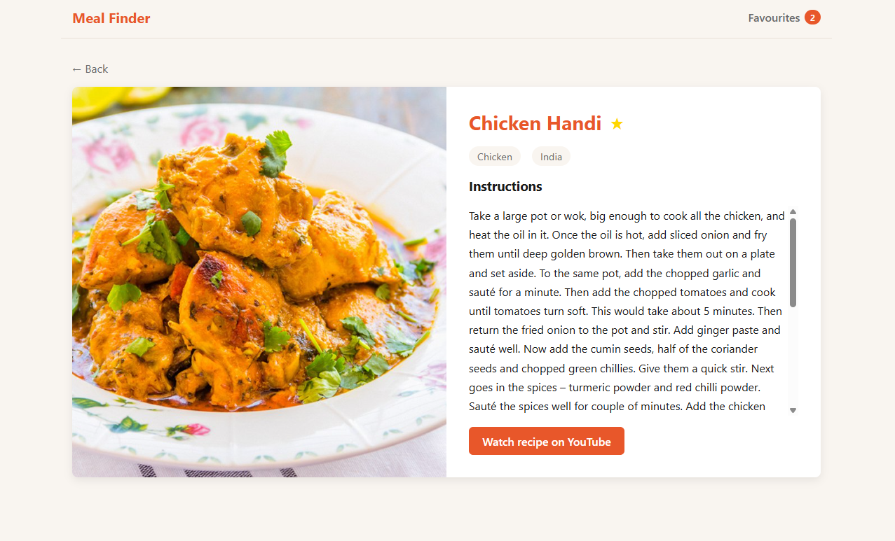
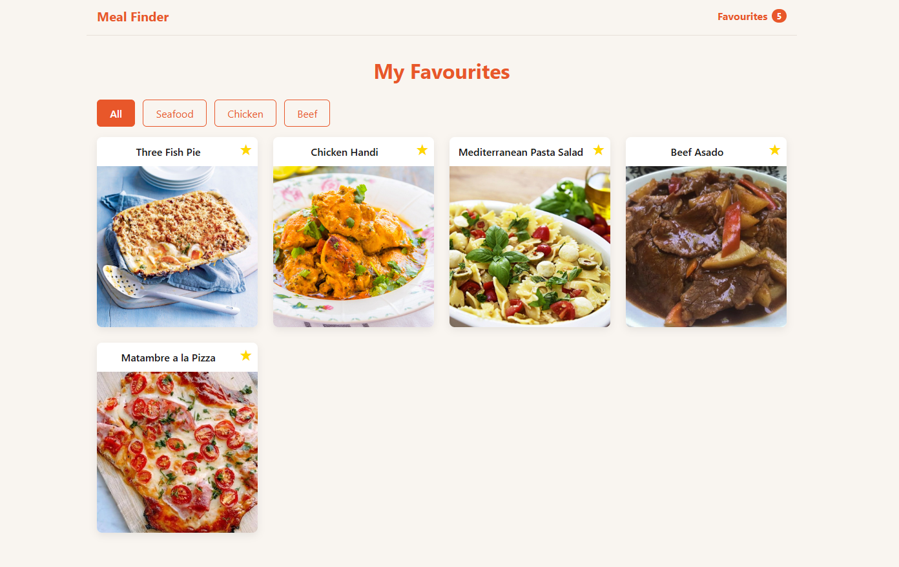

# Meal Finder

My 4th learning project — recipe search app where users find meals, view full recipes on a detail page and save favourites.

---

## Why this project

Most real Angular apps use dynamic URLs — a product ID, a user profile, a recipe. I built this project to understand how route parameters and browser history work, and how to build a more complete UX with multiple states: loading, no results, empty favourites.

---

## Live demo

https://04mealfinder.netlify.app/

---

## Screenshots

**Search results**


**Meal detail**



**Favourites**



---

## Features

- Search meals by name using TheMealDB API
- Browse results as cards with image and name
- Click a meal to see the full recipe on a detail page
- Save and remove favourite meals
- Filter favourites by category
- Persistent favourites across page refreshes

---

## Architecture decisions

- `MealService` and `FavouriteService` split by responsibility to keep the favourites page free of `HttpClient` and the search page free of persistence
- `effect()` + `localStorage` in `FavouriteService` to sync every change automatically, with no save call anywhere in the app
- `computed()` for every derived value — filtered lists, unique categories, the nav count, a `Set` of favourite ids — to memoise them and keep templates free of method calls that re-run on each change detection
- `toSignal(paramMap)` + `effect()` on the detail page to reload the recipe when only `:id` changes, since the router reuses the component instance
- The search term kept in the URL as `?q=` to make results survive navigation and `/` linkable
- `Location.back()` guarded by a `NavigationHistoryService` count to fall back to `/` when a detail URL was opened directly, since browser history is not application history
- `loadComponent()` on every route to ship each page as its own chunk instead of one bundle carrying all four (253 kB → 238 kB)
- A `**` wildcard route declared last to render a not-found page instead of an empty outlet, since route matching is first-wins
- The empty-search guard placed in `onSearchMeals()` rather than only in the button's `[disabled]` to cover the Enter key, a second entry path to the same operation
- Nav and favourites badge in the root component around `<router-outlet />` to survive the destruction of each routed page
- `meal-card` and `category-filter` kept presentational — `input.required()` in, `output()` out, no service injected — to let the search page and the favourites page reuse the same card
- One failure translation in `MealService` (`catchError` rethrowing a domain `Error`) to give every page a single failure shape to handle
- `HttpParams` for every query string to stop `&`, `#` and `+` in a search term from silently changing what was searched for
- Separate `isLoading`, `loadFinished` and `hasError` signals to tell four states apart, since TheMealDB answers an unknown id with `200 {"meals": null}` and a single results array expresses neither

---

## Tradeoffs

- TheMealDB over a keyed recipe API — no secret to manage in a public repo and a one-command clone-and-run, giving up server-side filtering and a dataset I could extend
- `subscribe` inside an `effect()` over the `async` pipe — the component owns the loading, empty, not-found and error states explicitly, at the cost of wiring the teardown by hand in the effect's cleanup callback
- Favourites in `localStorage` over a backend — persistence with no server to build, so favourites live in one browser and are lost when its storage is cleared

---

## Future improvements

- Search by ingredient
- Meal planner — assign meals to days of the week
- Shopping list generated from a selected meal plan

---

## What I learned

- Route parameters — `path: 'detail/:id'` read from `paramMap` as a stream, not a `snapshot`
- `effect()` — run a side effect automatically when a signal it reads changes
- `effect()` cleanup — the cleanup callback cancels the in-flight request before the effect re-runs
- `computed()` — derive filtering, counts and unique categories from signals
- A `computed()` `Set` for membership — derive the lookup structure, not a per-item predicate a template calls
- `RouterOutlet` and the app shell — the router destroys the routed component, so persistent chrome lives in the root
- View state in the URL — `?q=` written with `router.navigate()`, read back with `toSignal(queryParamMap)`
- Narrowing beats asserting — a `string | null` route id is read into a local and returned early on, never `as string`
- `localStorage` + `effect()` — init the signal from storage, keep it in sync automatically
- `asReadonly()` — keep the writable signal private so the service's own methods are the only writers
- Nullable API responses — `Meal[] | null` normalised once at the service boundary; pages never see the envelope
- One failure shape — `catchError` maps transport errors to a domain `Error` so pages do not each normalise them
- `HttpParams` — query values are encoded, never interpolated into the URL string
- Explicit remote states — the error flag is set by the callback that observes the failure, never inferred from absent data
- `Location.back()` is browser history, not app history — counting `NavigationEnd` events tells whether this app ever navigated
- Lazy routes — `loadComponent()` moves each page out of the initial bundle
- `**` wildcard route — matches first-wins, so it is declared last
- Container / presentational split — `input()` in, `output()` out, no domain state, which is what lets two parents reuse a child
- `:host` — an extracted component's wrapper is `display: inline` by default, so the parent's layout moves into its stylesheet
- Navigating elements are links — `<a [routerLink]>` gives focus, Enter, the `link` role and open-in-new-tab for free
- Acting elements are buttons — an `<a>` with no `href` is skipped by the tab order and never fires on Enter
- Resetting a native control — a text-styled `<button>` needs `background`, `border`, `padding`, `cursor` undone and `font: inherit`
- Interactive content does not nest — the favourite button is positioned over the card's link, not inside it
- `:focus-visible` + `:has()` — a focus ring for keyboard entry only, raised from the link to the whole card
- `(keyup.enter)` and `[disabled]` — a second entry path to a method, and a button disabled by a reactive condition
- Accessible name of a form control — a `<label for>` names the field; a `placeholder` is an example value
- One `h1` per routed page — headings are the document outline, not a size scale
- `.visually-hidden` — a clipped one-pixel box keeps text in the accessibility tree, which `display: none` removes
- Colour only through tokens — every colour is a custom property in `styles.css`, so a theme change is one edit
- `routerLinkActive` — marks the current nav link; the brand link needs `{ exact: true }` because matching is prefix-based
- Pressed state of a toggle — `[class.active]` for the eye and `[attr.aria-pressed]` for the accessibility tree
- Decorative images take `alt=""` — an absent `alt` leaves the image named after its file; a filled one repeats the caption
- Accessible name of an icon-only control — `★` computes to no name, so the toggle carries an `aria-label` stating its state
- `[attr.x]` binding — ARIA attributes have no DOM property behind them, so they need attribute binding
- `overflow: hidden` on a card — clips image corners with `border-radius`
- `position: absolute` + `top/right` — place a badge over a card
- `transition` on the base element, not on `:hover` — correct hover animation pattern

---

## Tech stack

| Layer | Technology |
|---|---|
| Framework | Angular 21 |
| Language | TypeScript |
| Routing | Angular Router — lazy routes, route + query parameters |
| State | Angular signals — `signal`, `computed`, `effect` |
| HTTP | `HttpClient` + `HttpParams` |
| Persistence | Browser `localStorage` |
| Styles | CSS with custom-property tokens |
| API | TheMealDB (free, no API key) |
| Hosting | Netlify |

---

## Project structure

```
src/
├── app/
│   ├── components/          presentational components — data in, events out, no service injected
│   │   ├── meal-card/       meal image, name and favourite toggle; reused by search and favourites
│   │   └── category-filter/ category buttons for the favourites page
│   ├── models/              the Meal domain type
│   ├── pages/               routed pages — search, meal detail, favourites, not found
│   ├── services/            MealService (HTTP), FavouriteService (state + localStorage),
│   │                        NavigationHistoryService (navigation count for the Back control)
│   ├── app.routes.ts        lazy route table, wildcard route last
│   ├── app.config.ts        application providers — router and HttpClient
│   └── app.ts / app.html    root shell — nav with the live favourites badge, plus the router outlet
└── styles.css               global styles and the colour tokens every component reads
```

---

## How to run

```
git clone https://github.com/VMNunez/dev-learning.git
```

```
cd dev-learning/projects/04-meal-finder
```

```
npm install
```

```
npm start
```

Open your browser at `http://localhost:4200`
