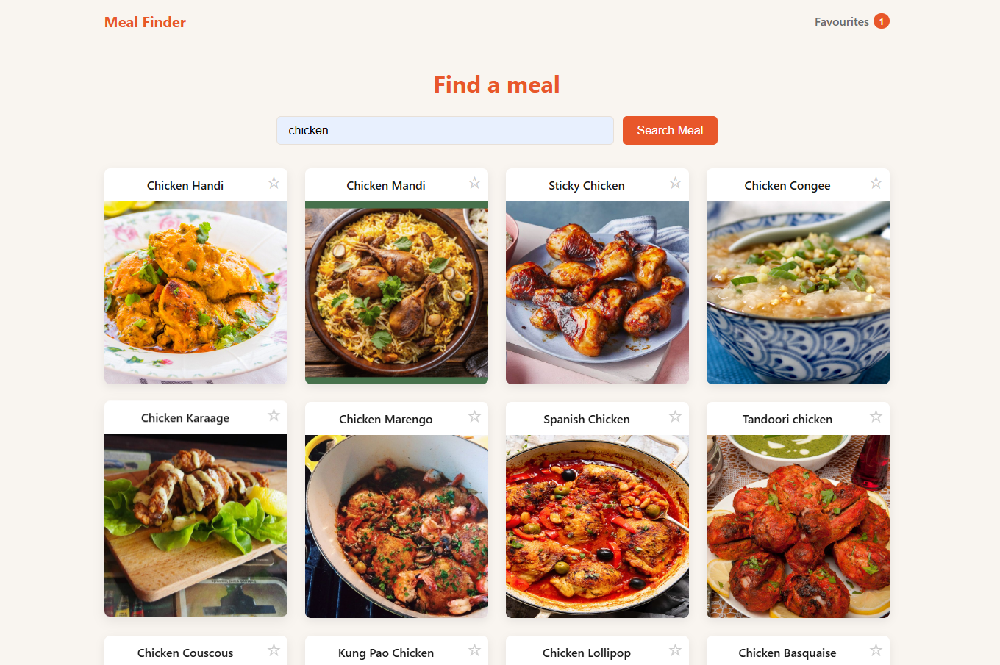
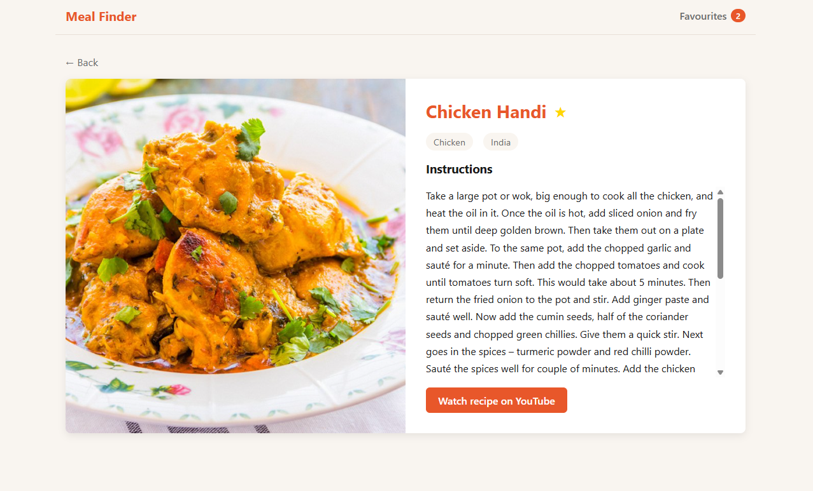
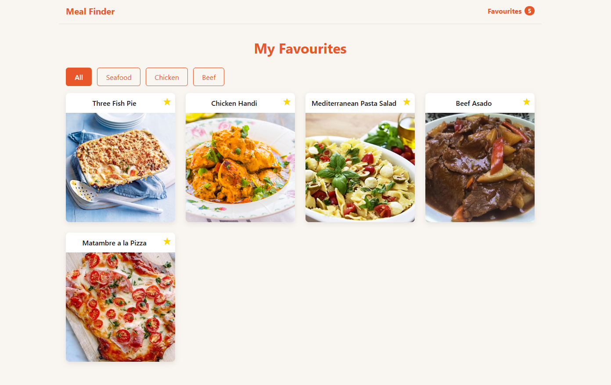

# Meal Finder

My 4th learning project — recipe search app where users find meals, view full recipes on a detail page and save favourites.

         

**[▶ Try the live app](https://04mealfinder.netlify.app/)**

---

## Why this project

I built this project to learn route parameters, how a component reads them with `ActivatedRoute`, and how `effect()` runs side effects when state changes. To practise them, I built a recipe finder on a free public recipe database: the search term lives in the address bar, every recipe opens on its own detail page, and favourites saved in the browser survive between visits. Every request shows whether it is loading, found nothing or failed.

---

## Live demo

https://04mealfinder.netlify.app/

---

## Screenshots

**Search results**



**Meal detail**



**Favourites**



---

## Features

- Search meals by name and browse the results as a grid of cards
- Click a meal to see the full recipe on a detail page
- Save and remove favourite meals
- The Favourites link in the navigation bar carries a live count that changes the moment a meal is saved or removed
- Filter favourites by category
- Persistent favourites across page refreshes
- The search term stays in the address bar, so opening a recipe and coming back keeps the results and a search can be shared as a link
- A spinner while a search runs, a "no meals found" message when nothing matches and an error message when the request fails — never a blank screen
- The meal grid and the recipe layout adapt from a single column on mobile to a multi-column grid on desktop
- Fully usable with a keyboard alone, with every control's state and name announced to screen readers

---

## Architecture decisions

- `MealService` and `FavouriteService` split by responsibility to keep the favourites page free of `HttpClient` and the search page free of persistence
- `effect()` + `localStorage` in `FavouriteService` to persist every change automatically, with no save call anywhere in the app
- `computed()` for every derived value, to recompute it only when its inputs change instead of on every change detection
- `toSignal(paramMap)` on the `detail/:id` route to reload the recipe when only `:id` changes, since the router reuses the component instance
- The search term kept in the URL as `?q=` to make results survive navigation and a search linkable
- `Location.back()` guarded by a `NavigationHistoryService` count to fall back to `/` when a detail URL was opened directly, since browser history is not application history
- `loadComponent()` on every route to ship each page as its own chunk instead of one bundle carrying all four (253 kB → 238 kB)
- `meal-card` and `category-filter` kept presentational to leave every piece of state in the pages and let the search and favourites pages reuse one card
- `catchError` in `MealService` rethrowing a domain error to give every page a single failure shape to handle
- `HttpParams` for every query string so `&`, `#` and `+` in a search term cannot silently change what was searched for
- Separate `isLoading`, `loadFinished` and `hasError` signals to tell loading, empty, not-found and error apart, since TheMealDB answers an unknown id with `200 {"meals": null}`

---

## Tradeoffs

- TheMealDB over a keyed recipe API — no secret to manage in a public repo and a one-command clone-and-run, giving up a larger catalogue and search that combines criteria such as ingredients, diet and cuisine
- `subscribe` inside an `effect()` over the `async` pipe — the component owns the loading, empty, not-found and error states explicitly, at the cost of wiring the teardown by hand in the effect's cleanup callback
- Favourites in `localStorage` over a backend — persistence with no server to build, so favourites live in one browser and are lost when its storage is cleared

---

## Future improvements

- Search by ingredient
- Meal planner — assign meals to days of the week
- Shopping list generated from a selected meal plan

---

## What I learned

- `HttpClient` — call an external API from a service, never from a component
- `HttpParams` — build the query string so user input cannot become query syntax
- `catchError` — translate an HTTP failure into one domain error the pages handle
- `signal()` and `computed()` — reactive state and derived values
- A `computed()` returning a `Set` of ids — favourite membership queried with `has(id)` in O(1), recomputed only when the underlying list changes instead of on every change detection
- `asReadonly()` — expose a signal read-only so the service's own methods are the only writers
- `effect()` — sync a signal with an external system (localStorage) instead of writing in every mutator
- `effect()` cleanup — cancel the in-flight request before the effect re-runs
- Route and query parameters — `detail/:id` gives each recipe its own URL and `?q=` keeps the search in the address bar
- `toSignal()` — read `paramMap` and `queryParamMap` as signals instead of subscribing
- `input.required()` and `output()` — presentational components take data in and emit intent out
- `loadComponent()` — lazy route, one chunk per page instead of one bundle
- `**` wildcard route — an unmatched URL renders the not-found page; declared last, since matching is first-wins
- `@if` / `@else if` / `@for` — built-in control flow renders one remote state at a time, no `*ngIf` import
- `Location.back()` — browser history is not application history, so a direct URL needs a fallback
- `[attr.x]` binding — sets an HTML attribute, not a DOM property, which is how `aria-pressed` reaches screen readers here
- `ariaCurrentWhenActive` (with `routerLinkActive`) — marks the current nav link with `aria-current`, exposing it to screen readers
- Narrowing beats asserting — read a `string | null` route id into a local and return early, never `as string`
- Nullable API responses — normalise `Meal[] | null` once at the service boundary
- `<a>` vs `<button>` — an `<a>` navigates, a `<button>` acts; an `<a>` with no `href` is skipped by the tab order
- `aria-label` and `<label for>` — a name for an icon-only control, and for a field whose `placeholder` is only an example
- `.visually-hidden` — a clipped one-pixel box keeps text in the accessibility tree, which `display: none` removes
- `alt=""` — mark a decorative image so it is not named after its file
- `:focus-visible` + `:has()` — a focus ring for keyboard entry only, raised to the whole card

---

## Tech stack

| Layer | Technology |
|---|---|
| Framework | Angular 21 |
| Language | TypeScript |
| Routing | Angular Router — lazy routes, route + query parameters |
| State | Angular signals — `signal`, `computed`, `effect` |
| HTTP | `HttpClient` + `HttpParams` |
| Reactivity | RxJS — `catchError`, manual `subscribe` |
| Persistence | Browser `localStorage` |
| Markup | HTML5 |
| Styles | CSS with custom-property tokens |
| API | TheMealDB (free, no API key) |
| Hosting | Netlify |

---

## Project structure

```
src/
├── app/
│   ├── components/          presentational components — data in, events out, no service injected
│   │   ├── meal-card/       meal image, name and favourite toggle; reused by search and favourites
│   │   └── category-filter/ category buttons for the favourites page
│   ├── models/              the Meal domain type
│   ├── pages/               routed pages — search, meal detail, favourites, not found
│   ├── services/            MealService (HTTP), FavouriteService (state + localStorage),
│   │                        NavigationHistoryService (navigation count for the Back control)
│   ├── app.routes.ts        lazy route table, wildcard route last
│   ├── app.config.ts        application providers — router and HttpClient
│   └── app.ts / app.html    root shell — nav with the live favourites badge, plus the router outlet
└── styles.css               global styles and the colour tokens every component reads
```

---

## How to run

```
git clone https://github.com/VMNunez/dev-learning.git
```

```
cd dev-learning/projects/04-meal-finder
```

```
npm install
```

```
npm start
```

Open your browser at `http://localhost:4200`
