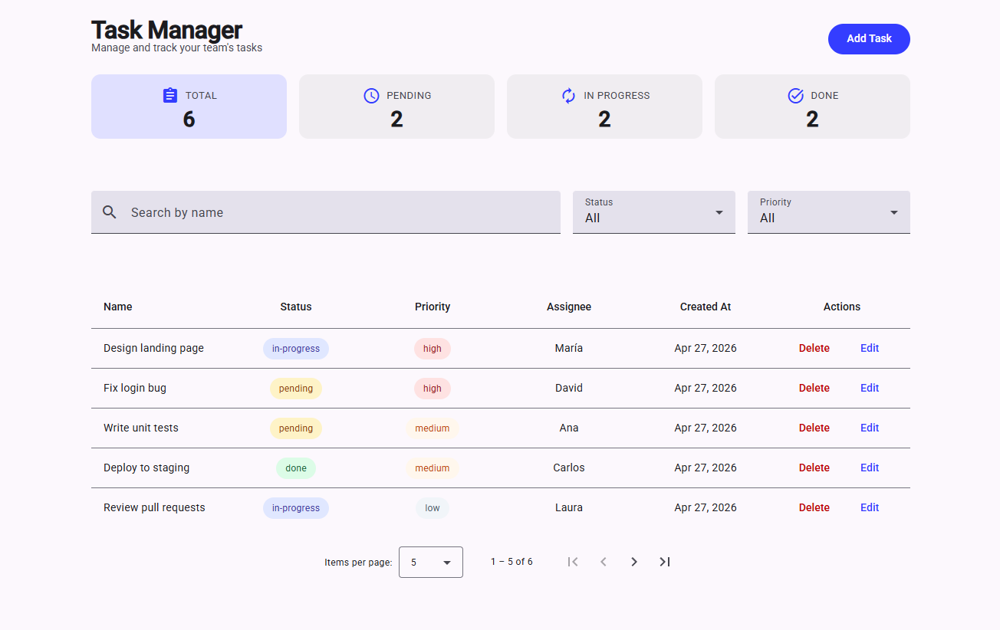

# Task Manager

My 5th learning project — task management app where users create, edit and delete tasks, filter by status and priority, and see live statistics.

---

## Why this project

Most real business apps use a UI component library instead of building everything from scratch. I built this project to learn Angular Material — the table, dialog and form components that appear in almost every enterprise Angular app.

---

## Live demo

https://05taskmanager.netlify.app/

---

## Screenshots

**App overview**



---

## Features

- List tasks in a Material table with sortable columns
- Add and edit tasks in a dialog with form validation
- Delete tasks with a confirmation step
- Filter tasks by status, priority and name
- Live stat cards — show task counts per status
- Clear filters button — only appears when a filter is active
- Task count badge — "Showing X of Y" when filters are active
- Data persists after page refresh

---

## Architecture decisions

- Coordinator pattern on the page to avoid passing the task list through multiple levels — table, filters and dialog all share the same state, and the page is the single place that manages it
- `MatTableDataSource` instead of a plain array to get sorting and pagination for free — connecting it to `MatSort` in `ngAfterViewInit` is all it takes
- Dual-mode dialog for add and edit to avoid maintaining two near-identical forms — the dialog checks `MAT_DIALOG_DATA` to decide its mode and calls `patchValue()` in edit mode
- Reusable `ConfirmDialog` in `shared/` so delete, discard-changes and clear-filters all use the same confirmation component with different text
- `ErrorStateMatcher` to delay validation errors until submit instead of showing them as soon as a field is touched — better UX for forms the user is still filling in

---

## Tradeoffs

- Angular Material over plain CSS — adds a dependency but matches what enterprise teams actually use, which is the point of this project
- `localStorage` over a real backend — the focus was Material and CRUD patterns, not data persistence

---

## Future improvements

- Pagination for large task lists
- Due dates with overdue highlighting
- Export tasks to CSV

---

## What I learned

- `MatTableModule` + `MatTableDataSource` — Material table with sorting and filtering
- `MatSort` + `@ViewChild` + `ngAfterViewInit` — connect sorting to the table after the view loads
- `MatDialog.open()` + `afterClosed()` — open a dialog and receive data back
- `MAT_DIALOG_DATA` — inject data passed by the parent into the dialog
- `MatDialogRef.close(value)` — close the dialog and pass a value back
- `patchValue()` — pre-fill a reactive form with existing data for edit flows
- `ErrorStateMatcher` — custom class that controls when `mat-error` appears
- `NgClass` — apply multiple CSS classes dynamically based on task data
- `mat.theme()` in `material-theme.scss` — set palette and typography once for the whole app
- Context-specific themes — scope `mat.theme()` to a CSS class for a different palette per component
- `--mat-sys-*` CSS variables — Material design tokens for theme-aware colors
- Coordinator pattern — page owns all state; child components only display and emit
- Local date components over `toISOString()` — `toISOString()` reads the clock in UTC, so a date derived from it shifts the day after local midnight
- CSS grid — `grid-template-columns: 1fr 1fr` for two-column forms; `grid-column: 1 / -1` to span full width
- `table-layout: fixed` + `.mat-column-*` — control column widths in a Material table

---

## Tech stack

| Layer | Technology |
|---|---|
| Framework | Angular 21 |
| UI library | Angular Material 21 |
| Language | TypeScript |
| Styles | CSS |

---

## How to run

```
git clone https://github.com/VMNunez/dev-learning.git
```

```
cd dev-learning/angular/05-task-manager
```

```
npm install
```

```
npm start
```

Open your browser at `http://localhost:4200`
