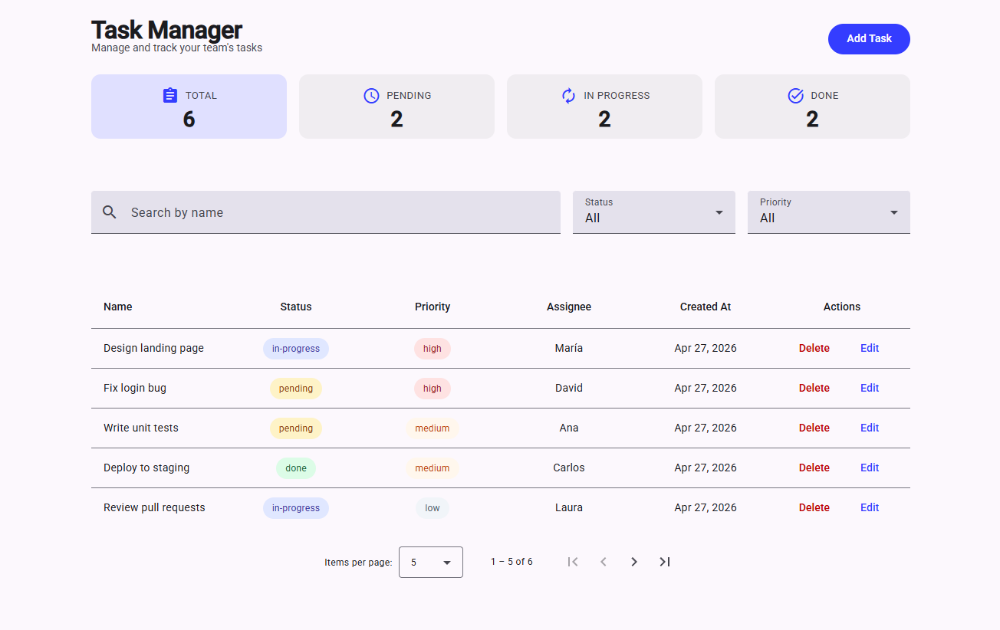
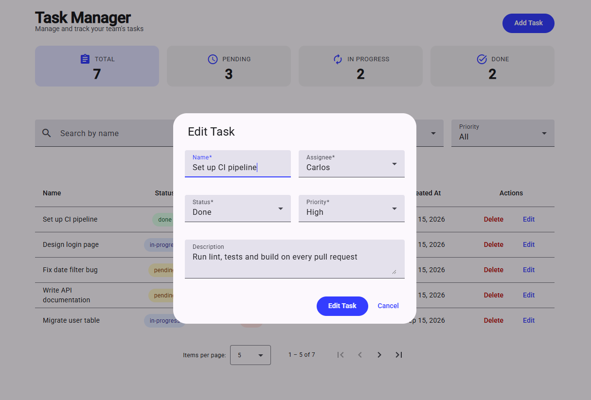

# Task Manager

My 5th learning project — task manager where you create your team's tasks, assign each one to a member and track them by status and priority.

**Angular 21 · Angular Material 21 · TypeScript · localStorage**

[Live demo](#live-demo) · [Run locally](#how-to-run)

---

## Why this project

A team loses track of its work when tasks live in chat threads and in people's heads: nobody can say who owns a task, how urgent it is or how much is still open. This portfolio app gives every task an assignee, a status and a priority, keeps the whole list in one table that can be sorted, searched and filtered, and shows at a glance how many tasks are pending, in progress and done.

---

## Live demo

https://05taskmanager.netlify.app/

---

## Screenshots

**Task list with filters and stat cards**



**Add/edit task dialog**



---

## Features

- List tasks in a table with sortable columns and pagination for long lists
- Add and edit tasks in a dialog, giving each one an assignee from the team, a status and a priority
- Missing required fields are flagged when you try to save, not while you are still typing
- Deleting a task asks for confirmation first, and so does cancelling a form with unsaved changes
- Filter tasks by status, priority and name
- Live stat cards count the tasks in each status, and clicking one filters the table to that status
- Clear filters button — only appears when a filter is active
- "Showing X of Y" count — appears while a filter is active
- An empty table tells you whether there are no tasks yet or none match your filters
- Data persists after page refresh

---

## Architecture decisions

- Coordinator pattern on the task page to centralise state and events and keep the table and filters presentational and reusable
- `MatTableDataSource` instead of a plain array to get sorting and pagination without hand-writing them
- Filtering as a `computed()` in the coordinator instead of `MatTableDataSource.filterPredicate` to combine status, priority and name as three typed signals
- Dual-mode dialog for add and edit to avoid maintaining two near-identical forms that would drift apart
- Reusable `ConfirmDialog` to give delete and discard-changes one confirmation component with different title, message and button labels
- `effect()` in `TaskService` to persist every change to the task signal, so no component has to remember to save
- `ErrorStateMatcher` to delay validation errors until submit, so a form the user is still filling in does not scold them mid-typing
- Scoped Material theme in `material-theme.scss` instead of overriding Material's CSS to keep the delete button's red inside the theme system, where a palette change still reaches it

---

## Tradeoffs

- Angular Material over hand-built components — a heavier bundle and Material's look to work within, in exchange for the accessible table, dialog and form fields enterprise teams already use
- `localStorage` over a real backend — keeps the focus on the Material UI, at the cost of a task list that lives in one browser and is never shared with the rest of the team

---

## Future improvements

- A shared backend, so the whole team works on one task list from any device
- Due dates with overdue highlighting
- Export tasks to CSV

---

## What I learned

- `MatTableModule` + `MatTableDataSource` — Material table built from `matColumnDef` column definitions over a data source that owns sorting and pagination
- `MatSort` + `MatPaginator` + `@ViewChild` + `ngAfterViewInit` — connect sorting and pagination to the table after the view loads
- `*matNoDataRow` — the table's own empty-state row, worded differently for no tasks yet and for no matches
- `MatDialog.open()` + `MAT_DIALOG_DATA` + `MatDialogRef.close()` + `afterClosed()` — the dialog round trip: the parent's data in on open, the result back on close
- Test doubles for runtime-minted tokens — `MatDialog.open()` creates `MatDialogRef` and `MAT_DIALOG_DATA`, so the dialog specs provide both with `useValue` instead of opening a real dialog
- `patchValue()` — pre-fill a reactive form with existing data for edit flows
- `ErrorStateMatcher` — custom class that controls when `mat-error` appears
- `mat.theme()` — one theme definition for the whole app, re-scoped to a CSS class for the delete button, so no Material style is overridden by hand
- `--mat-sys-*` tokens — component CSS reads theme roles instead of hard-coded colors, so a palette change reaches custom styles too
- `signal()` and `computed()` — writable state and derived values; the filtered list and the stat-card counts are computed from the task signal, never stored twice
- `input()` and `output()` — signal-based component API: data down from the parent, events up from the child
- `effect()` — bridge a signal to a non-reactive API; it writes the task list to `localStorage` and pushes it into `MatTableDataSource`
- Coordinator pattern — page owns all state; child components only display and emit
- `crypto.randomUUID()` for entity ids — a clock reading collides when two records are created in the same millisecond
- Local date components over `toISOString()` — `toISOString()` reads the clock in UTC, so a date derived from it shifts the day after local midnight
- Stored data as untrusted input — `JSON.parse` on a `localStorage` value is wrapped in `try`/`catch` and checked with `Array.isArray`, so corrupted storage falls back to an empty list, not a crash
- Native `<button>` over `role="button"` — the tag supplies Space, Enter and focus; `[attr.aria-pressed]` states which stat-card filter is active
- `LiveAnnouncer` — CDK service that announces the new sort direction to screen readers, which get no visual arrow

---

## Tech stack

| Layer | Technology |
|---|---|
| Framework | Angular 21 |
| UI library | Angular Material 21 |
| Language | TypeScript |
| State | Angular signals — `signal`, `computed`, `effect` |
| Forms | Angular Reactive Forms (typed) |
| Storage | `localStorage` |
| Styles | CSS + SCSS (Material theming) |
| Testing | Vitest + TestBed — dialog component specs |
| Deployment | Netlify |

---

## Project structure

```
src/app/
├── app.ts                          root shell, renders the router outlet
├── app.routes.ts                   single route to the task page
├── models/
│   └── task.model.ts               Task interface and its status/priority union types
└── pages/
    └── task-page/
        ├── task-page.ts            coordinator — owns all state and handles child events
        ├── components/
        │   ├── task-table/         displays the Material table, emits edit/delete
        │   ├── task-filters/       status, priority and name filters, emits changes
        │   ├── task-dialog/        reactive form dialog, add and edit mode
        │   └── confirm-dialog/     reusable confirmation dialog
        └── services/
            └── task.service.ts     signal<Task[]> with CRUD and localStorage persistence
```

Global styles live in `src/styles.css`; the Material palette and the scoped delete-button theme live in `src/material-theme.scss`.

---

## How to run

```
git clone https://github.com/VMNunez/dev-learning.git
```

```
cd dev-learning/projects/05-task-manager
```

```
npm install
```

```
npm start
```

Open your browser at `http://localhost:4200`
