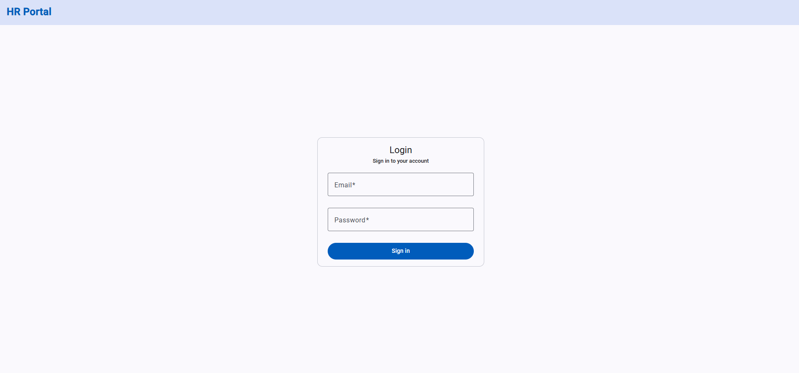
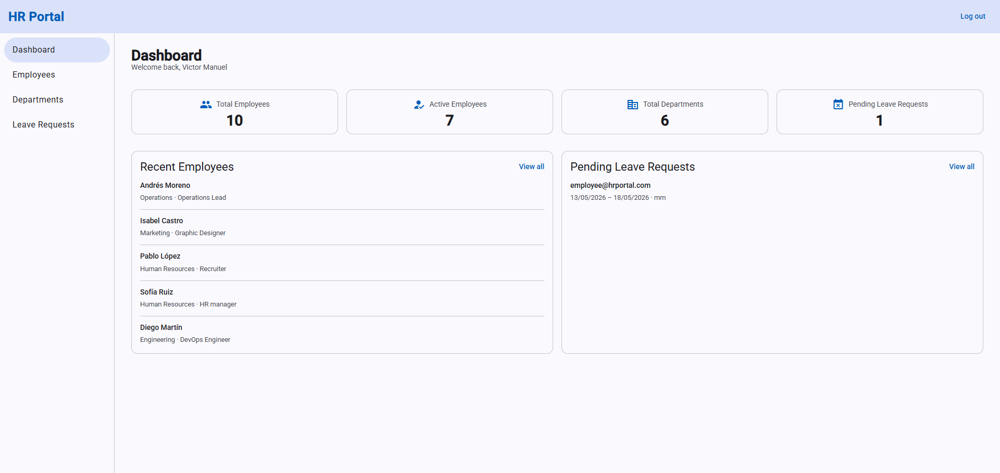
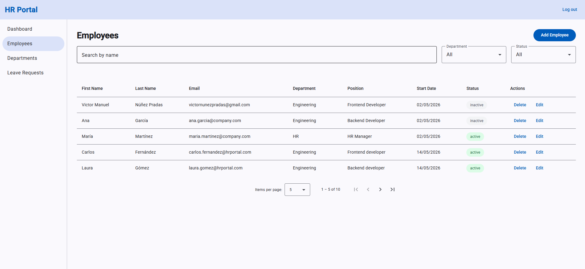
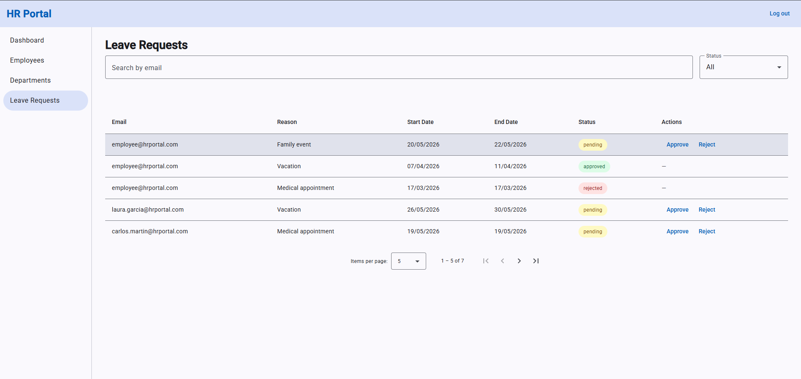

# HR Portal

My 6th learning project — HR management app where admins manage employees and leave requests, and employees track their own requests, with role-based access throughout.

---

## Why this project

Most production Angular apps have protected routes, role-based views, and HTTP layers that attach credentials automatically. I built this project to understand how those patterns work in practice — guards, interceptors, lazy loading — before applying them in a real codebase.

---

## Live demo

https://06-hr-portal.netlify.app

**Test accounts:**
- Admin: `admin@hrportal.com` / `admin123`
- Employee: `employee@hrportal.com` / `employee123`

---

## Screenshots

**Login**



**Admin dashboard**



**Employee management**



**Leave requests**



---

## Features

- Protected routes redirect unauthenticated users to login
- Admin and employee roles see different pages, sidebar links and dashboard content
- Employee CRUD — multi-step creation form, edit dialog, soft delete
- Department CRUD — unsaved-changes warning when navigating away mid-form
- Leave requests — employees submit, admins approve or reject
- Auth token attached automatically to every outgoing HTTP request

---

## Architecture decisions

- Core/Feature/Shared structure to separate singleton logic, feature areas and reusable UI
- Lazy loading on all feature routes to avoid loading admin-only code for every user on every visit
- Stacked guards (`authGuard` + `adminGuard`) to keep authentication and authorisation as separate concerns
- Coordinator pattern on pages with filters and a table to centralise state and keep children reusable
- `MatStepper` for employee creation to split a long form into manageable steps
- Unique-email check at the dialog's save exit rather than in the `Next` handler — a linear stepper lets a completed step be re-entered from its header, which skips that button
- `CanDeactivate` only on the department form — a dialog has no route, so a route guard structurally cannot attach to the employee and leave-request flows; the routed form is where the unsaved-changes confirmation is possible at all, and departments carry the fewest fields so they pay the least for the extra navigation
- `filteredNavLinks computed()` in the root component to keep sidebar links in sync with the current user without duplicating role checks in children
- Entity ids generated inside the owning service with `crypto.randomUUID()` — a clock reading gives two records created in the same millisecond the same id, and letting the calling component build the entity would put the rule in as many places as there are callers
- Leave-request transitions guarded in `LeaveRequestService` rather than in the template that hides the buttons — the template only decides what is drawn, so a rule that lives there is bypassed by every other caller and the invalid state still reaches localStorage
- The leave-request filter's permitted values declared once as an `as const` list with the union derived from it — the dropdown's options, the runtime check and the type are one declaration, so adding a status cannot leave the guard rejecting it
- The status union carried into the filter child's `input()` and `output()` rather than left as `string` — a value validated at the query-param read re-widens at the component boundary otherwise, and the compiler stops rejecting a filter no record can match
- The employee dialog closes with the same `Omit<Employee, 'id'>` payload in both modes and the page re-stamps the id it already holds — a union of two result shapes would compile only by making every caller narrow it, and the id is the row's, never the form's
- localStorage with signals and `effect()` to decouple data persistence from the Angular patterns being practised
- A credential-free session shape in localStorage — only the email and role the app reads back, re-projected on read so an entry saved by an older build drops its password

---

## Tradeoffs

- localStorage over a real backend — the focus of this project was Angular patterns, not data persistence
- Single `isAdmin()` computed signal over role checks scattered across components — one place to change if the role logic evolves
- Functional guards (`CanActivateFn`) over class-based guards — Angular v15+ convention, less boilerplate
- No real bearer token — with no backend to issue or verify one, the interceptor sends the session email under the `Bearer` scheme and the file says so at the point of use, so the wiring is exercised without the code claiming authentication it does not perform

---

## Future improvements

- Replace localStorage with a real REST API backend
- Email notifications when leave requests are approved or rejected
- Export leave request history to PDF or CSV

---

## What I learned

- `CanActivateFn` — functional route guard; no class, no `@Injectable`
- `canActivate: [authGuard, adminGuard]` — stacked guards; all must pass for the route to activate
- `noAuthGuard` — redirects already-logged-in users away from the login page
- `loadComponent` with dynamic import — lazy loading; component code only loads on navigation
- `HttpInterceptorFn` — functional interceptor; clones the request to add the auth header, here carrying a placeholder value rather than an issued token
- `CanDeactivateFn` — warns the user before leaving a form with unsaved changes
- `takeUntilDestroyed()` — cancels work still in flight when the page is destroyed; called outside a constructor it needs the `DestroyRef` passed explicitly
- Content projection with `ng-content` — the dashboard's panel wrapper takes its rows as projected markup, so three panels listing different entities share one card shell instead of the wrapper growing an input per shape
- `MatStepper` — multi-step form with `[linear]="true"` and per-step form group validation
- Validation display state — an error renders only once the control is `touched`; validity alone is true from construction, so an ungated `required` accuses the user before any interaction
- `MatSnackBar` — toast notifications after every key action
- `MatSidenav` app shell — persistent sidebar with role-filtered navigation links
- `MatDatepicker` — calendar picker with `provideNativeDateAdapter()`
- Typed reactive forms — `MatDatepicker` writes a `Date` into its control, so one inferred from `''` needs an `as unknown as Date` at every read; `FormControl<Date | null>` removes the cast
- Typed dialog results — `MatDialog.open<T, D, R>` leaves `R` at `any`, so naming the result type there and on the dialog's own `MatDialogRef` turns a renamed field into a compile error instead of a blank value
- Local-clock date serialization — `toISOString()` shifts a picked date to UTC, so `YYYY-MM-DD` is built from `getFullYear`/`getMonth`/`getDate`
- Conditional `displayColumns` with `computed()` — show or hide table columns based on role
- Query params — `[queryParams]` on `routerLink`, read with `ActivatedRoute.snapshot.queryParamMap`
- Route params are always text — `paramMap.get('id')` returns `string | null`, so converting it has to agree with the model's id type or the lookup silently finds nothing
- Query params are untrusted text too — an unrecognised `?status=` is rejected by a `value is T` predicate and the filter falls back to `all`, instead of being asserted into the union and rendering an empty table
- Auth persistence — `signal()` initialised from localStorage + `effect()` to save on every change
- A refused write has to be visible — `updateStatus` returns a `boolean` so the page's snackbar reports the refusal instead of confirming a change that never happened
- App shell scroll layout — `overflow: hidden` on `app-root` keeps toolbar and sidebar fixed
- `routerLink` needs an `<a>` — on any other element it navigates on click but writes no `href`, so the card is not Tab-reachable and announces no link role

---

## Tech stack

| Layer | Technology |
|---|---|
| Framework | Angular 21 |
| UI library | Angular Material 21 |
| Language | TypeScript |
| Styles | CSS |

---

## Project structure

```
src/app/
├── core/                        ← singleton logic — one instance for the whole app
│   ├── guards/                  ← auth, admin, no-auth, deactivate guards
│   ├── interceptors/            ← auth interceptor — attaches token to every request
│   └── services/                ← auth, employee, department, leave-request services
├── pages/                       ← one folder per route
│   ├── login-page/
│   ├── dashboard-page/
│   ├── employee-page/
│   │   └── components/          ← dialog, filters, table
│   ├── department-page/
│   │   └── components/
│   └── leave-request-page/
│       └── components/
├── shared/                      ← reusable UI used in more than one feature
│   └── components/
│       └── confirm-dialog/
└── models/                      ← TypeScript interfaces
```

---

## How to run

```
git clone https://github.com/VMNunez/dev-learning.git
```

```
cd dev-learning/angular/06-hr-portal
```

```
npm install
```

```
npm start
```

Open your browser at `http://localhost:4200`
