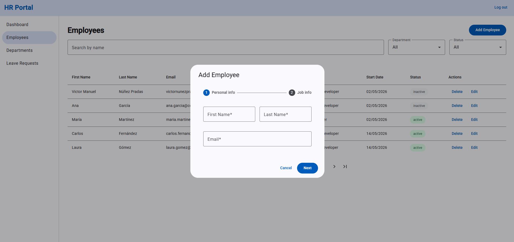

# HR Portal

My 6th learning project — HR portal where admins manage employees, departments and leave requests, and employees check their own data and ask for time off.

---

## Why this project

Most production Angular apps have protected routes, role-based views, and HTTP layers that attach credentials automatically. I built this project to understand how those patterns work in practice — guards, interceptors, lazy loading — before applying them in a real codebase.

---

## Live demo

https://06-hr-portal.netlify.app

**Test accounts:**
- Admin: `admin@hrportal.com` / `admin123`
- Employee: `employee@hrportal.com` / `employee123`

---

## Screenshots

**Login**


**Admin dashboard**


**Employee management**


**Employee creation form**



**Leave requests**


---

## Features

- Protected routes redirect unauthenticated users to login
- Admin and employee roles see different pages, sidebar links and dashboard content
- Employee CRUD — multi-step creation form, edit dialog, soft delete
- Department CRUD — unsaved-changes warning when navigating away mid-form
- Leave requests — employees submit, admins approve or reject
- The session survives a page reload — you stay signed in until you log out

---

## Architecture decisions

- Core/Feature/Shared structure to separate singleton logic, feature areas and reusable UI
- Lazy loading on all feature routes to avoid loading admin-only code for every user on every visit
- Stacked guards (`authGuard` + `adminGuard`) to keep authentication and authorisation as separate concerns
- Coordinator pattern on pages with filters and a table to centralise state and keep children reusable
- `MatStepper` for employee creation to split a long form into manageable steps
- `CanDeactivate` only on the routed department form — a dialog has no route, so a route guard structurally cannot attach to the employee and leave-request flows
- `filteredNavLinks computed()` in the root component to keep sidebar links in sync with the current user without duplicating role checks in children
- Entity ids generated inside the owning service to keep the rule in one place instead of in every calling component
- Leave-request transitions guarded in `LeaveRequestService` rather than in the template that hides the buttons — a rule that lives in the template is bypassed by every other caller
- The leave-request filter's permitted values declared once as an `as const` list to keep the dropdown's options, the runtime check and the type a single declaration
- localStorage with signals and `effect()` to decouple data persistence from the Angular patterns being practised
- A credential-free session shape in localStorage — only the email and role the app reads back are stored, so no password is kept in the browser
- A `Bearer` header carrying the session email, documented as a placeholder where it is set — with no backend to issue or verify a token, the wiring is exercised without the code claiming authentication it does not perform

---

## Tradeoffs

- localStorage over a real backend — the focus of this project was Angular patterns, not data persistence
- Client-only role checks over server-enforced authorisation — `adminGuard` and `isAdmin()` are the only gate with no API behind them, so a user who edits localStorage directly can reach admin views; a real backend would refuse the request regardless of what the client claims
- Single `isAdmin()` computed signal over role checks scattered across components — one place to change if the role logic evolves
- Functional guards (`CanActivateFn`) over class-based guards — Angular v15+ convention, less boilerplate

---

## Future improvements

- Replace localStorage with a real REST API backend
- Email notifications when leave requests are approved or rejected
- Export leave request history to PDF or CSV

---

## What I learned

- `CanActivateFn` — functional route guard; no class, no `@Injectable`
- `canActivate: [authGuard, adminGuard]` — stacked guards; all must pass for the route to activate
- `noAuthGuard` — redirects already-logged-in users away from the login page
- `loadComponent` with dynamic import — lazy loading; component code only loads on navigation
- `HttpInterceptorFn` — functional interceptor; clones the request to add the auth header, here carrying a placeholder value rather than an issued token
- `CanDeactivateFn` — warns the user before leaving a form with unsaved changes
- `markAsPristine()` — clears the dirty flag after a successful save so the unsaved-changes guard stops firing
- `takeUntilDestroyed()` — cancels work still in flight when the page is destroyed; called outside a constructor it needs the `DestroyRef` passed explicitly
- Content projection with `ng-content` — the dashboard's panel wrapper takes its rows as projected markup, so three panels listing different entities share one card shell instead of the wrapper growing an input per shape
- `MatStepper` — multi-step form with `[linear]="true"` and per-step form group validation
- Validation display state — an error renders only once the control is `touched`; validity alone is true from construction, so an ungated `required` accuses the user before any interaction
- `MatSnackBar` — toast notifications after every key action
- `MatSidenav` app shell — persistent sidebar with role-filtered navigation links
- `MatDatepicker` — calendar picker with `provideNativeDateAdapter()`
- Local-clock date serialization — `toISOString()` shifts a picked date to UTC, so `YYYY-MM-DD` is built from `getFullYear`/`getMonth`/`getDate`
- Conditional `displayColumns` with `computed()` — show or hide table columns based on role
- Query params — `[queryParams]` on `routerLink`, read with `ActivatedRoute.snapshot.queryParamMap`
- Route params are always text — `paramMap.get('id')` returns `string | null`, so converting it has to agree with the model's id type or the lookup silently finds nothing
- Query params are untrusted text too — an unrecognised `?status=` is rejected by a `value is T` predicate and the filter falls back to `all`, instead of being asserted into the union and rendering an empty table
- Auth persistence — `signal()` initialised from localStorage + `effect()` to save on every change
- Signal reference vs snapshot — passing `service.signal` shares the live signal, while `service.signal()` freezes a value the child never sees change
- A refused write has to be visible — `updateStatus` returns a `boolean` so the page's snackbar reports the refusal instead of confirming a change that never happened
- App shell scroll layout — `overflow: hidden` on `app-root` keeps toolbar and sidebar fixed
- `routerLink` needs an `<a>` — on any other element it navigates on click but writes no `href`, so the card is not Tab-reachable and announces no link role

---

## Tech stack

| Layer | Technology |
|---|---|
| Framework | Angular 21 |
| UI library | Angular Material 21 |
| Language | TypeScript |
| Styles | CSS |
| Persistence | Browser localStorage |

---

## Project structure

```
src/app/
├── core/                        ← singleton logic — one instance for the whole app
│   ├── guards/                  ← auth, admin, no-auth, deactivate guards
│   ├── interceptors/            ← auth interceptor — attaches the header to every request
│   └── services/                ← auth, employee, department, leave-request services
├── pages/                       ← one folder per route
│   ├── login-page/
│   ├── dashboard-page/
│   │   └── components/          ← panel wrapper, panel item, stat card
│   ├── employee-page/
│   │   └── components/          ← dialog, filters, table
│   ├── department-page/
│   │   ├── components/          ← list
│   │   └── department-form/     ← routed form — the only CanDeactivate target
│   └── leave-request-page/
│       └── components/          ← dialog, filters, table
├── shared/                      ← reusable UI and helpers used in more than one feature
│   ├── components/
│   │   └── confirm-dialog/
│   └── utils/                   ← date and localStorage helpers
└── models/                      ← TypeScript interfaces
```

---

## How to run

```
git clone https://github.com/VMNunez/dev-learning.git
```

```
cd dev-learning/projects/06-hr-portal
```

```
npm install
```

```
npm start
```

Open your browser at `http://localhost:4200`
