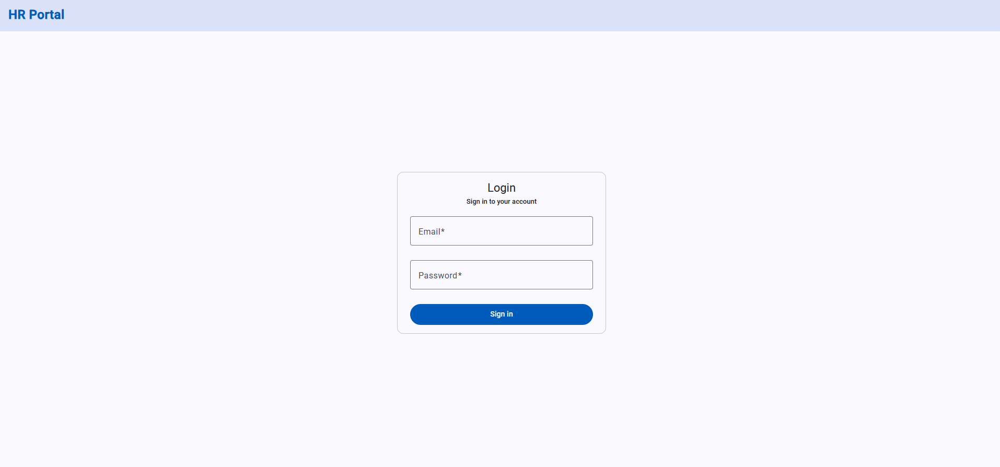
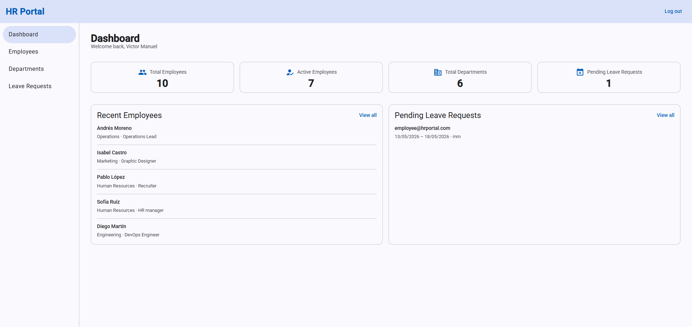
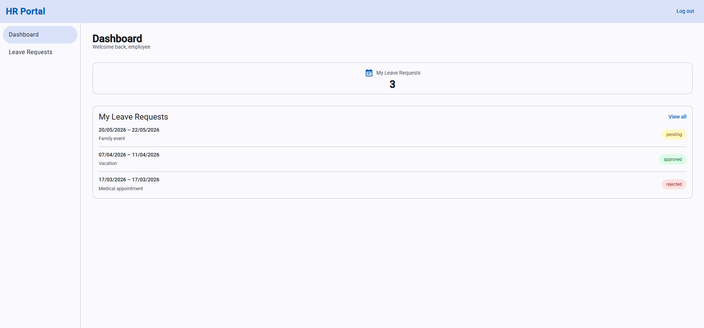
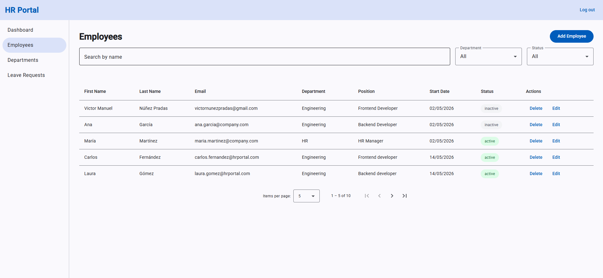
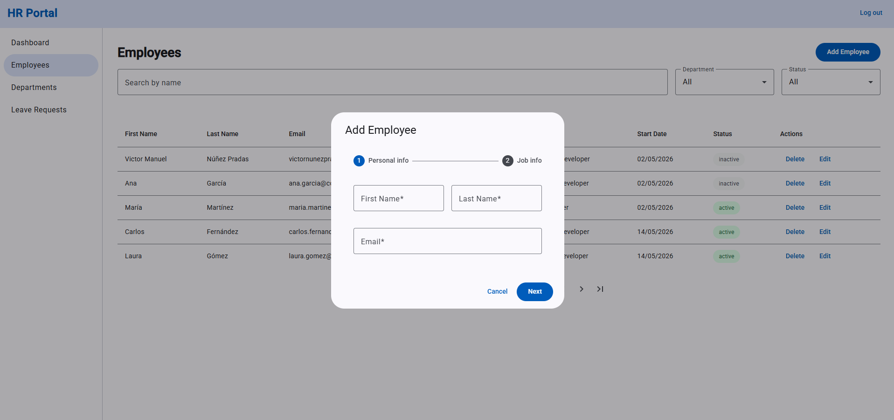
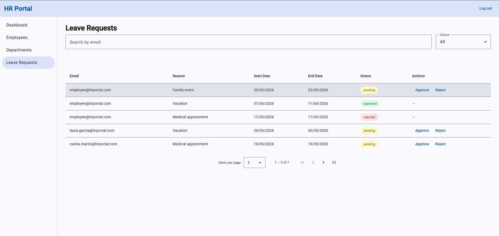

# HR Portal

My 6th learning project — HR portal where admins manage employees, departments and leave requests, and employees check their own data and ask for time off.

        

---

## Live demo

**[▶ Try the live app](https://06-hr-portal.netlify.app)**

<table>
<tr><th>Role</th><th>Email</th><th>Password</th></tr>
<tr><td>Admin</td><td>

```text
admin@hrportal.com
```

</td><td>

```text
admin123
```

</td></tr>
<tr><td>Employee</td><td>

```text
employee@hrportal.com
```

</td><td>

```text
employee123
```

</td></tr>
</table>

---

## Why this project

I built this project to learn advanced Angular routing: functional guards, lazy-loaded routes, an HTTP interceptor and role-based access enforced in the router rather than in the templates. To practise it, I built an HR portal with two roles on one dataset. Admins manage employees and departments and decide on leave requests, while employees see only their own data and ask for time off, and every leave request has an owner, a reviewer and a final outcome.

---

## Screenshots

**Login**



**Admin dashboard**



**Employee dashboard**



**Employee management**



**Employee creation form**



**Leave requests (admin view)**



---

## Features

- Protected routes redirect unauthenticated users to login
- Admin and employee roles see different pages, sidebar links and dashboard content
- Admins add and edit employees through a two-step form, and deleting one asks for confirmation first
- Admins create, edit and delete departments; the department form warns before you leave it with unsaved changes
- Employees submit leave requests; admins approve or reject the pending ones, and a decision is final
- Dashboard cards open their list already filtered — active employees, pending leave requests
- Employee and leave-request lists can be searched, filtered by status, sorted and paged
- The session survives a page reload — you stay signed in until you log out

---

## Architecture decisions

- Core/Feature/Shared structure to separate singleton logic, feature areas and reusable UI
- Lazy loading on all feature routes to avoid loading admin-only code for every user on every visit
- Stacked guards (`authGuard` + `adminGuard`) to keep authentication and authorisation as separate concerns
- Coordinator pattern on pages with filters and a table to centralise state and keep children reusable
- `filteredNavLinks computed()` in the root component to keep sidebar links in sync with the current user without duplicating role checks in children
- Leave-request transitions guarded in `LeaveRequestService`, ids generated per entity in its own service, to enforce transitions for every caller, not only the screen that hides the buttons
- Statuses, filters and roles declared once as `as const` lists to derive each type from its runtime values, so dropdowns, runtime checks and types cannot drift apart
- Signals persisted to localStorage by an `effect()` to make the stored copy follow every change instead of each writer saving it by hand
- A credential-free session (email and role only) in localStorage to keep no password in the browser
- A functional auth interceptor with a placeholder `Bearer` value to keep the header wiring ready ahead of a real API

---

## Tradeoffs

- localStorage over a real backend — keeps the focus on Angular, at the cost of per-browser data and client-only role checks that editing localStorage can bypass
- A routed department form over a dialog like the employee and leave-request flows — `CanDeactivate` needs a route to guard unsaved changes, at the cost of two different add/edit flows in one app
- Functional guards (`CanActivateFn`) over class-based guards — Angular v15+ convention, less boilerplate

---

## Future improvements

- A real REST API backend, so data is shared across devices and role checks are enforced on the server
- Email notifications when leave requests are approved or rejected
- Export leave request history to PDF or CSV

---

## What I learned

- `CanActivateFn` — functional route guard; no class, no `@Injectable`; inverted in `noAuthGuard` to redirect an already-logged-in user away from login
- `canActivate: [authGuard, adminGuard]` — stacked guards; all must pass for the route to activate
- `loadComponent` with dynamic import — lazy loading; component code only loads on navigation
- `HttpInterceptorFn` — functional interceptor; clones the request to add the auth header, here carrying a placeholder value rather than an issued token
- `CanDeactivateFn` — warns the user before leaving a form with unsaved changes
- `markAsPristine()` — clears the dirty flag after a successful save so the unsaved-changes guard stops firing
- `takeUntilDestroyed()` — cancels work still in flight when the page is destroyed; called outside a constructor it needs the `DestroyRef` passed explicitly
- `ng-content` — content projection; one dashboard card shell takes its rows as markup instead of growing an input per entity shape
- `MatStepper` — multi-step form with `[linear]="true"` and per-step form group validation
- Validation at the save exit — a linear stepper lets the user re-enter a completed step from its header, so the unique-email check runs again on save, not only on `Next`
- `touched`-gated errors — a `required` control is invalid from construction, so its error waits until the user has visited the field
- `MAT_DIALOG_DATA` — one dialog serves add and edit, switching mode on whether data was injected
- `MatSidenav` app shell — persistent sidebar with role-filtered navigation links
- `MatDatepicker` — calendar picker with `provideNativeDateAdapter()`
- Local-clock date serialization — `toISOString()` shifts a picked date to UTC, so `YYYY-MM-DD` is built from `getFullYear`/`getMonth`/`getDate`
- Conditional `displayColumns` with `computed()` — show or hide table columns based on role
- Chained filter `computed()`s — the employee and leave-request lists combine several filter signals with `&&`, each falling back to a no-filter default like `'all'` or `''`
- Query params — `[queryParams]` on `routerLink`, read with `ActivatedRoute.snapshot.queryParamMap`
- Route params are always text — `paramMap.get('id')` returns `string | null`, so converting it has to agree with the model's id type or the lookup silently finds nothing
- Auth persistence — `signal()` initialised from localStorage + `effect()` to save on every change
- Signal reference vs snapshot — passing `service.signal` shares the live signal, while `service.signal()` freezes a value the child never sees change
- A refused write has to be visible — `updateStatus` returns a `boolean` so the page's snackbar reports the refusal instead of confirming a change that never happened
- `value is T` predicates — untrusted input (a `?status=` query param, the session parsed from localStorage) is narrowed by a check instead of asserted into the type
- Union type reaches the child — a filter child's `input()`/`output()` are typed to the union itself, not `string`, so a value already narrowed at the query-param read cannot re-widen at the component boundary
- `dialog.open<T, D, R>` — naming the result type makes `afterClosed()` type-checked instead of `any`
- `FormControl<Date | null>` — typed to what `MatDatepicker` writes, so the submit reads a `Date` without a cast
- App shell scroll layout — `overflow: hidden` on `app-root` keeps toolbar and sidebar fixed
- `routerLink` needs an `<a>` — on any other element it navigates on click but writes no `href`, so the card is not Tab-reachable and announces no link role
- Active-link focus fix — `a.active:focus:not(:hover)::before { opacity: 0 }` hides the hover wash on the current nav link without hiding the keyboard focus ring

---

## Tech stack

| Layer | Technology |
|---|---|
| Framework | Angular 21 |
| UI library | Angular Material 21 |
| Language | TypeScript |
| Routing | Angular Router — functional guards, lazy routes, query parameters |
| State | Angular signals — `signal`, `computed`, `effect` |
| Forms | Angular Reactive Forms (typed) |
| Persistence | Browser localStorage |
| Markup | HTML5 |
| Styles | CSS + SCSS (Material theming) |
| Deployment | Netlify |

---

## Project structure

```
src/app/
├── core/                        ← singleton logic — one instance for the whole app
│   ├── guards/                  ← auth, admin, no-auth, deactivate guards
│   ├── interceptors/            ← auth interceptor — placeholder Bearer header, ready for an API
│   └── services/                ← auth, employee, department, leave-request services
├── pages/                       ← one folder per route
│   ├── login-page/              ← credential form that writes the session
│   ├── dashboard-page/          ← role-aware: admin totals vs the employee's own requests
│   │   └── components/          ← panel wrapper, panel item, stat card
│   ├── employee-page/           ← admin only — coordinates filters, table and dialog
│   │   └── components/          ← dialog, filters, table
│   ├── department-page/         ← admin only — department list
│   │   ├── components/          ← list
│   │   └── department-form/     ← routed form — the only CanDeactivate target
│   └── leave-request-page/      ← both roles — admin reviews all, employee sees own
│       └── components/          ← dialog, filters, table
├── shared/                      ← reusable UI and helpers used in more than one feature
│   ├── components/
│   │   └── confirm-dialog/      ← yes/no dialog reused for deletes and unsaved changes
│   └── utils/                   ← date and localStorage helpers
└── models/                      ← domain interfaces, `as const` value lists and their type predicates
```

---

## How to run

```
git clone https://github.com/VMNunez/dev-learning.git
```

```
cd dev-learning/projects/06-hr-portal
```

```
npm install
```

```
npm start
```

Open your browser at `http://localhost:4200`
