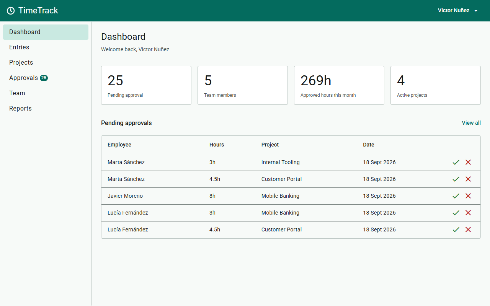
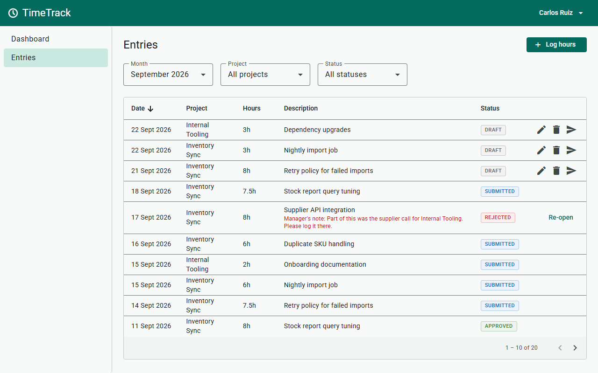
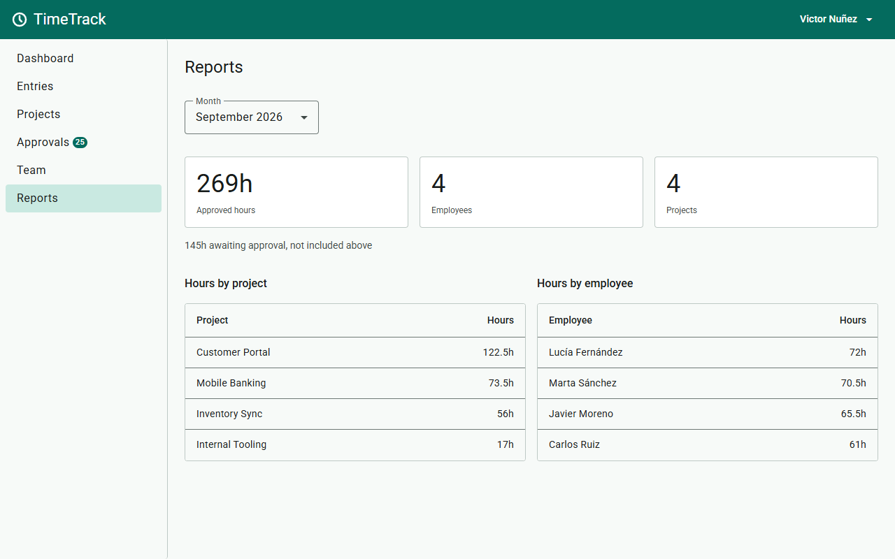
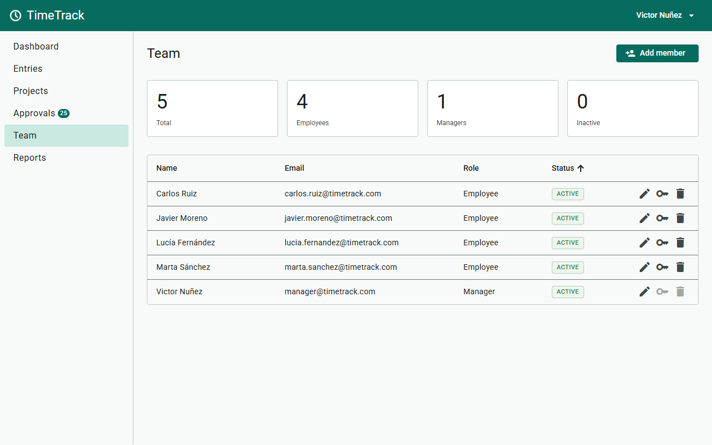

# TimeTrack

My 7th learning project and my first full-stack app — a timesheet where employees log the hours they work on projects and managers approve or reject every entry.

---

## Why this project

My previous six projects were Angular-only with localStorage as a fake backend. This is the step where everything connects: a real database, a real API and a real frontend talking to each other. I built it to understand how a full-stack app actually works — how Angular calls a Spring Boot API, how the server validates and protects data, and how both sides have to agree on a contract.

---

## Live demo

**[07-timetrack.netlify.app](https://07-timetrack.netlify.app)**

Demo login (manager): `manager@timetrack.com` / *(password — to be added)*

The API runs on a free tier that sleeps when idle, so the first login after a quiet spell can take about two minutes while it wakes up — later requests are fast.

---

## Screenshots

*(GIF — approval workflow: an employee logs and submits hours, a manager rejects the entry with a note, the employee re-opens and resubmits it — to be added)*

**Manager dashboard — pending approvals with one-click approve and reject**



**Entries — an employee's month, each row offering only the actions its status allows**



**Reports — approved hours by project and by employee, with pending hours kept apart**



**Team — accounts, roles and one-time password resets**



---

## Features

- Employees log time entries with project, date, hours and a description
- Every entry goes through a workflow: Draft → Submitted → Approved / Rejected
- Rejected entries show the manager's note and can be re-opened, corrected and resubmitted
- Entries can be filtered by month, project and status
- Manager dashboard with pending approvals and quick approve/reject actions
- Role-based access — employees see only their own data, managers see everything
- Reports with approved hours grouped by project and by employee for any month
- Managers create, edit and archive projects — an archived project keeps its hours but takes no new entries
- Accounts created by managers only — no public registration — and each new member gets a one-time generated password
- Everyone can change their own password, and a manager can reset a forgotten one
- Deactivated members can no longer log in, and the hours they logged stay in the reports
- Responsive — works on mobile and desktop

---

## Architecture decisions

- Workflow states (DRAFT → SUBMITTED → APPROVED / REJECTED) instead of a boolean to capture every step, enable the resubmit flow and give managers a clear queue of what needs attention
- Stateless JWT auth to keep the API independent of server state — and, because the token travels in a header the browser never attaches on its own, to make CSRF protection unnecessary
- SecurityContextHolder for the current user instead of a client-supplied userId to prevent privilege escalation — the client cannot choose which user the server acts as
- Manager-only account creation to prevent self-assignment of the Manager role
- Profile-gated runtime seeding of the first manager account to avoid both a setup endpoint that must be removed after first use and a credential hash committed to git
- PATCH for status transitions (submit, approve, reject) to signal that only one field changes — PUT would replace the whole resource
- DTO boundary between persistence and HTTP layer to control exactly what the API exposes and hides
- Soft delete for users and projects to preserve all historical time entry data — hard delete would orphan records
- Docker Compose to run Spring Boot and PostgreSQL together with one command
- Environment variables for every per-environment value (database URL, CORS origins, secrets) to run the same image locally, in Docker and on the public host with nothing secret in git

---

## Tradeoffs

- JWT over server-side sessions — the API keeps no session store and every request carries its own credential; given up: a logout cannot revoke an issued token before its 60-minute expiry, although deactivation is still checked on every request
- Soft delete over hard delete — deleting a user or a project would orphan the time entries that reference it; given up: a deactivated account keeps its email, so the same address cannot be registered again
- docker-compose over a manual local setup — the only prerequisite is Docker, and the API image is the one that gets deployed; given up: a slower edit-run loop, so daily development still runs from IntelliJ against a local database
- A public deployment over a local-only project — anyone can open the app without cloning it; given up: the free-tier API sleeps when idle and wakes slowly, and the demo data is writable by every visitor
- Deploying before the unit tests over tests first — a working app was available to open sooner; given up: the first public version shipped with only its validation and frontend unit tests in place, and the service-layer unit tests (JUnit 5 + Mockito, Vitest) still to follow

---

## Future improvements

- Export monthly reports to PDF or Excel
- Email notifications when entries are approved or rejected
- Bulk approval for managers handling large teams

---

## What I learned

### Backend

- Controller → Service → Repository layered architecture — each layer has one job, and the API returns only JSON because Angular is a separate app
- `@Entity` mapping — `@Id`/`@GeneratedValue` for the key (bare form resolves to `AUTO`, a Postgres/Hibernate 6 sequence, not native identity), `@Column(nullable = false, unique = true)` for the constraints and `@CreationTimestamp` for the insert time
- Defaults on both sides — `private boolean active = true` for an object built in Java, `@ColumnDefault` for a row written outside it
- `boolean` vs `Boolean` (`long` vs `Long`) — a wrapper only where `null` carries meaning, and the switch renames Lombok's getter from `getX()` to `isX()`
- `@Enumerated(EnumType.STRING)` — `Role` and `EntryStatus` are stored as their names, so reordering an enum never rewrites what old rows mean
- `JpaRepository` + derived queries — CRUD with no SQL, and finders like `existsByEmail` generated from the method name
- `@Service` / `@Component` + constructor injection — every collaborator and every `@Value` setting arrives as a `final` constructor parameter, so no bean is ever built half-configured
- DTOs (`Create*Request`, `Update*Request`, `*Response`) — the API contract stays separate from the entity, mapped in one `toResponse()` helper per service
- Optional field on an Update DTO (`Boolean active`, applied only when non-null) — lets `PUT` stay a full-replacement contract while still supporting reactivation of a soft-deleted row
- `@RestController` + `@GetMapping`/`@PostMapping`/`@PutMapping`/`@DeleteMapping` — one method per verb and path, with `@PathVariable` binding the URL segment and `@RequestBody` the JSON body
- `ResponseEntity<T>` — the status is explicit on every endpoint: `201` with a `Location` header on a create, `204` with `ResponseEntity<Void>` on a delete
- `Optional<T>` + custom unchecked exceptions — a missing row becomes a `ResourceNotFoundException` and a 404, never a `NullPointerException`
- `@RestControllerAdvice` — one `GlobalExceptionHandler` turns every exception into the same JSON error body
- Exception-to-status mapping — `InvalidStateTransitionException` → 409 for a state-machine conflict; `BusinessRuleViolationException` and `InvalidPasswordException` share 400 but stay separate classes so each carries the field its message belongs under
- Bean Validation (`@NotBlank`/`@NotNull` + `@Valid`) across every request DTO — accumulates all failed fields in one response, unlike fail-fast manual checks
- `@Size(max = ...)` on every request string — 72 on passwords, BCrypt's truncation boundary, caps the CPU an unauthenticated caller can burn
- `@Column(precision, scale)` + `@DecimalMin`/`@DecimalMax`/`@Digits` — `hours` is bounded at both the column and the request DTO, so an over-precise value gets a 400 instead of being silently rounded
- JWT structure — header, payload claims (`sub`, `iat`, `exp`) and an HMAC signature keyed by a Base64 secret decoded with `Keys.hmacShaKeyFor()`
- JWT `sub` holds the user id, not the email — an email a manager can edit and reassign would hand a still-valid token to its next owner
- Spring Security filter chain — a `OncePerRequestFilter` validates the token and puts the user in the `SecurityContext` before any controller runs
- `@PreAuthorize` on every endpoint — `hasRole('MANAGER')` answers an EMPLOYEE with 403, and even `isAuthenticated()` is written out so the filter chain is only the perimeter
- CORS — only the frontend's origins, methods and headers, bound as a `List<String>` so a comma-separated environment variable becomes separate entries
- Spring Security `/error` gotcha — an unhandled exception can return a misleading 401 if `/error` isn't excluded from `.anyRequest().authenticated()`
- `BCryptPasswordEncoder` — only a salted hash is stored, and `matches()` checks a login or a current password against it
- `SecureRandom` over `Random` — a generated account password must not be reconstructible from a predictable seed
- Login throttling — five failures per email or per IP answer 429 for one minute, checked before BCrypt runs and with no permanent lockout an attacker could trigger
- Account deactivation enforced twice — blocked at login by `.disabled(!user.isActive())`, and blocked on the next request by `AccountStatusUserDetailsChecker` in `JwtFilter`
- Token lifetime as a tradeoff — cutting `app.jwt.expiration` from 24h to 60min balances a usable work session against the blast radius of a token stolen from `localStorage`
- Role-based data filtering — `getAll()` branches between `findAll()` and `findByUser()` by reading authorities off `SecurityContextHolder`
- Broken object-level authorization (BOLA) — a filter on the list endpoint must also be applied on the detail endpoint (`getById`), returning 404 not 403 so the resource's existence isn't confirmed
- Segregation of duties — a manager cannot approve or reject their own time entry; ownership is resolved from the JWT via `SecurityContextHolder`, the same pattern used for every other ownership check
- `@ManyToOne` on `TimeEntry` to both `User` and `Project` — two foreign keys on the same entity
- N+1 fix — lazy `@ManyToOne` plus a `Specification`-driven `LEFT JOIN FETCH`, skipped on `COUNT` queries via `query.getResultType()`
- State machine workflow — `EntryStatus` moves `DRAFT` → `SUBMITTED` → `APPROVED`/`REJECTED`, each transition checks the current status first, and re-opening a rejected entry closes the resubmit loop
- PATCH with a URL suffix for state transitions (`/submit`, `/approve`, `/reject`) — PUT/POST/DELETE never need one because the verb alone is unambiguous
- Comparing JPA entities by id, not by object reference or full `.equals()` — Lombok's `@Data`-generated `equals()` is unreliable for entities
- `BigDecimal.compareTo()` and `LocalDate.isAfter()`/`isBefore()` — the correct way to compare values that don't support `==`, `<`, `>`, or a safe `.equals()`
- Soft delete for users and projects, hard delete for DRAFT entries — history keeps its not-null foreign keys pointing at a real row, while a draft holds nothing worth keeping
- Foreign key `ON DELETE RESTRICT` — can't delete a parent row while a child still references it (SQL state `23503`)
- `DataIntegrityViolationException` → 409 — the duplicate check gives a readable message, and `saveAndFlush` lets the unique index catch what the check misses
- `@Transactional` / `@Transactional(readOnly = true)` — an atomic write boundary on every service write method, and read-only intent declared on every pure-read method so the persistence provider can skip dirty checking
- `Specification<T>` + `JpaSpecificationExecutor` — dynamic optional filters built as predicates, one static factory per filter, `cb.conjunction()` when a filter is absent
- `Pageable` on `GET /api/entries` — page size capped at 100 with `id` as a tie-breaker, and `sort` keys checked against an allow-list
- `YearMonth` — binds automatically from `?month=2025-05`; `.atDay(1)`/`.atEndOfMonth()` convert it to a date range
- Interface projections — Spring Data builds a proxy per result row from `SELECT ... AS alias`, matched to getter names by convention
- Aggregating in the database rather than in memory — `SUM()` + `GROUP BY` on id and name (not name alone, which would merge two people sharing one) sums a report's rows in the query instead of loading them as entities
- Reports count trusted hours only — the aggregates filter on `status = APPROVED` so DRAFT/SUBMITTED/REJECTED never inflate the totals
- Repositories organized by entity, controllers/services by feature — a report query still lives on the entity's repository
- Spring profiles — `application-dev.properties` merges onto the base config, and a `@Profile("dev")` bean is never even instantiated outside that profile
- `CommandLineRunner` seed over `data.sql` — the first manager's password comes from an environment variable and is hashed at startup, with an `existsByEmail` guard making every later boot a no-op
- Least-privilege database role — the app connects as `timetrack_app`, a non-superuser that owns only the `timetrack` database, never as `postgres`
- SLF4J `Logger` over `System.out.println` — log levels, automatic context (timestamp/thread/class), and proper stacktrace formatting via `log.error("message", e)`
- Multi-stage `Dockerfile` — a JDK stage builds the jar and a JRE stage runs it as a non-root user, so the image ships no compiler
- docker-compose — the API image plus its own PostgreSQL, whose init script creates the non-superuser app role on its first start
- Configuration parity — the same image runs in IntelliJ, in compose and on the public host, every difference injected as an environment variable (`APP_CORS_ALLOWEDORIGINS` through relaxed binding)

### Frontend

- Angular against a real REST API — `HttpClient` calls typed with interfaces that mirror the backend DTOs field for field, the base URL swapped per build between localhost and the hosted API
- `HttpInterceptorFn` — attaches the Bearer token and turns a 401 on a token-bearing request into one "session expired" redirect, while the login form's own 401 stays a wrong-password error
- Functional guards — `CanActivateFn` keeps out a missing session or the wrong role, `CanDeactivateFn` keeps `/team` open while a one-time password is still on screen, and `CanMatchFn` lets `/dashboard` be declared twice so the role picks which page loads
- Page-owned signal state — each page holds its own `signal()`s and fetches for itself, and only the session and the pending-approvals count are app-wide
- Form dialogs own their write — data in through `MAT_DIALOG_DATA`, their own service call, and `close(result)` only on success, so field errors land under a form that is still open
- `Subject` + `switchMap` reload stream — a newer filter or month cancels the older request, so a slow answer never overwrites a fresh one
- `forkJoin` — the dashboard cards and the three report calls load as one all-or-nothing result
- Server-side paging and sorting — `MatPaginator` and `MatSort` drive the API's `page`, `size` and `sort` params instead of sorting a loaded array
- One error contract on both sides — the Angular client mirrors the backend's `ErrorResponse` as a typed `ApiError`, shows the server's own `message` and puts each `fieldErrors` entry under its control with `setErrors()`
- Runtime type guard before `localStorage` — `http.post<T>()` only asserts a type, so the login response passes `isAuthResponse` before it is stored and again on every reload
- `takeUntilDestroyed()` — every subscription in a class ends with its component, a dialog's included
- In-flight state per row — busy ids live in a `ReadonlySet`, so two rows writing at once both stay guarded against a second click
- One-time secret dialog — only Done closes it, and `cdkCopyToClipboard` reports whether the browser accepted the copy
- Calendar dates as local `YYYY-MM-DD` — `toISOString()` would shift a picked day to UTC and save the day before east of Greenwich
- A string-literal union from an `as const` array — one list feeds both the `EntryStatus` type and the status filter's options
- Container queries — stat cards and filter bars reflow by the width the sidenav leaves the page, not by the window's
- `role="alert"` line kept in the DOM — empty until it has a message, because an alert inserted together with its text may never be announced
- Focus handed back after a write — `afterNextRender` returns focus to a control the refetch did not remove, instead of dropping it to `<body>`
- `TitleStrategy` — every route writes its own page name into the browser tab, with the brand appended once
- Status never by colour alone — every badge shows its word, and its colours are checked at 4.5:1 at badge size

---

## Tech stack

| Layer | Technology |
|---|---|
| Backend | Java 25 + Spring Boot 4 |
| Auth | Spring Security + JWT |
| Database | PostgreSQL |
| ORM | Spring Data JPA + Hibernate |
| Frontend | Angular 21 + Angular Material |
| Testing | JUnit 5 + AssertJ (backend) · Vitest + TestBed (frontend) |
| Local setup | Docker + docker-compose |
| Hosting | Render (API container) · Neon (PostgreSQL) · Netlify (frontend) |

---

## Project structure

```
07-timetrack/
├── backend/                              ← Spring Boot API — see backend/README.md for its package layout
├── frontend/                             ← Angular app — see frontend/README.md for its folder layout
├── docker/db/init/                       ← Creates the app's non-superuser role on the compose database
├── docker-compose.yml                    ← API + PostgreSQL in one command
└── screenshots/                          ← Images used in this README
```

---

## How to run

The quickest way to try it is the [live demo](#live-demo). To run it locally, start the backend and then the frontend.

### Backend — with Docker

**Requirements:** Docker. From `projects/07-timetrack/`, copy `.env.example` to `.env` and fill in its four
values — `JWT_SECRET` is decoded as Base64, so generate it with `openssl rand 64 | openssl base64 -A` — then:

```bash
docker compose up --build
```

The API is at `http://localhost:8080`, backed by its own PostgreSQL, and seeds `manager@timetrack.com` with
the password you set in `ADMIN_PASSWORD`.

Without Docker — IntelliJ and a local PostgreSQL — follow
[backend/README.md → How to run alone](backend/README.md#how-to-run-alone).

### Frontend

**Requirements:** Node.js. In a second terminal, from `projects/07-timetrack/frontend/timetrack/`:

```bash
npm install
```

```bash
npm start
```

Open `http://localhost:4200` and log in as `manager@timetrack.com` with your `ADMIN_PASSWORD`.

---

Full technical details: [backend/README.md](backend/README.md) and [frontend/README.md](frontend/README.md)
